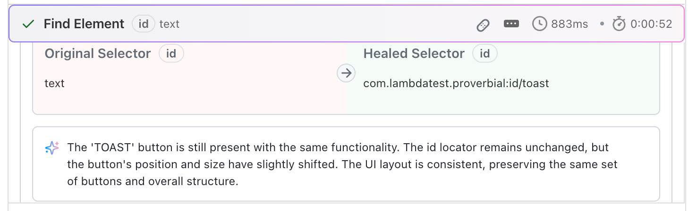
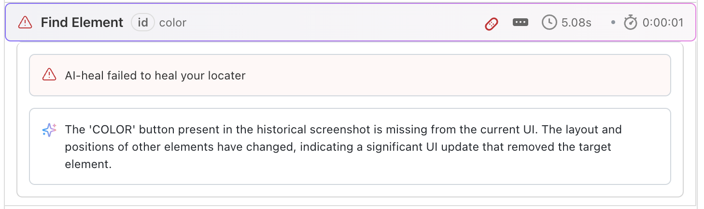

import CodeBlock from '@theme/CodeBlock';
import {YOUR_LAMBDATEST_USERNAME, YOUR_LAMBDATEST_ACCESS_KEY} from "@site/src/component/keys";

import Tabs from '@theme/Tabs';
import TabItem from '@theme/TabItem';

# Auto-Heal

In mobile test automation, flaky tests caused by dynamic UI changes and locator failures can slow down development and reduce confidence in test suites. LambdaTest’s **Auto-Heal** feature for Appium automatically detects locator failures at runtime, analyzes the UI to find the closest matching element , and retries the step seamlessly—without human intervention. By combining AI/ML-based healing with full transparency in logs and dashboards, Auto-Heal delivers more stable runs, faster debugging, and reduced maintenance effort.

> To enable it for your organization, please contact us via <span className="doc__lt" onClick={() => window.openLTChatWidget()}>**24×7 chat support**</span> or you can also drop a mail to **support@lambdatest.com**.<br /> 

---
## Use Cases

- **Frequent UI Updates**: When product teams ship fast and locator changes are common, Auto-Heal prevents brittle tests from breaking on every release.
- **Cross-Device Testing**: Ensure consistency when the same locator behaves differently across device types or OS versions.
- **CI/CD Reliability**: Reduce flaky build failures by automatically recovering from locator issues in pipelines.
- **Maintenance Reduction**: Spend less time fixing scripts manually and more time building new coverage.
- **Audit & Debugging**: Use healed locator logs and screenshots to understand changes quickly and improve your scripts over time.

---
## Auto-Heal Workflow 

1. **Baseline Creation**  
   On your first successful test run with Auto-Heal enabled, LambdaTest captures a baseline snapshot of all element locators used in your test script. This baseline serves as the reference point for future healing attempts.

2. **Detection and Healing**  
   In subsequent test runs, if a locator fails to find its element (e.g., due to UI changes), Auto-Heal is triggered. The engine then uses AI/ML algorithms to analyze the failed locator’s context—including element attributes, hierarchy, and visual features—and searches the current UI for the best possible match.

3. **Retry with Healed Locator**  
   If a suitable alternative element is found, the test step is retried with the healed locator. The healing attempt and result are logged.

4. **Fallback and Suggestions**  
   If no healing is possible, Auto-Heal logs AI-driven suggestions to help you update your locators manually.


---

## Auto-Heal in Automation Tests

### 1. Upload Your App

Before enabling Auto-Heal, ensure your app is uploaded to LambdaTest.

1. Follow the [Upload Your Application](https://www.lambdatest.com/support/docs/upload-your-application/) guide.
2. Once uploaded, **note the App ID** returned by the API or dashboard.
3. Use this **App ID** in the `"app"` capability in your automation script.

---

### 2. Enable Auto-Heal with Capabilities

To enable Auto-Heal, add `"smartHeal": true` to your desired capabilities in your Appium test script.

<Tabs className="docs__val">
<TabItem value="ios" label="iOS" default>

```python
desired_caps = {
    "deviceName": "iPhone 12",
    "platformName": "iOS",
    "platformVersion": "14",
    "isRealMobile": True,
    "app": "YOUR_APP_URL",
    "build": "Auto-Heal iOS",
    "name": "Sample Auto-Heal Test",
    # highlight-next-line
    "smartHeal": True
}
```

</TabItem>

<TabItem value="android" label="Android" default>

```python
desired_caps = {
    "deviceName": "Galaxy S20",
    "platformName": "Android",
    "platformVersion": "10",
    "isRealMobile": True,
    "app": "YOUR_APP_URL",
    "build": "Auto-Heal Android",
    "name": "Sample Auto-Heal Test",
    # highlight-next-line
    "smartHeal": True
}
```

</TabItem>
</Tabs>

:::tip
- You can generate capabilities for your test requirements with the help of our inbuilt [**Capabilities Generator tool**](https://www.lambdatest.com/capabilities-generator/). For more details, please refer to our guide on [**Desired Capabilities in Appium**](https://www.lambdatest.com/support/docs/desired-capabilities-in-appium/).
:::

### 3. Enable Auto-Heal with Runtime Hooks

You can also control Auto-Heal dynamically during test execution using runtime hooks. This is useful when you want healing active in specific phases or after major UI changes.

```java
// Start Auto-Heal
driver.executeScript("lambda-heal-start");

// Stop Auto-Heal
driver.executeScript("lambda-heal-stop");

```

### 4. Running Your Tests

Once your app is uploaded and Auto-Heal is enabled (either via capabilities or runtime hooks), execute your test script as usual with your preferred automation framework. Auto-Heal will monitor for locator failures during the run, apply healing when possible, and log all details to the LambdaTest dashboard for review.


:::info
**Requirements for Auto-Heal**
- For Auto-Heal to work effectively, there must be at least one successful baseline run of your test cases. This baseline provides the reference point for the healing engine to detect changes and attempt recovery. Without a passing baseline, Auto-Heal cannot apply locator healing.

- For every user, the **project name** and **test name** must remain the same across runs for Auto-Heal to be applied successfully.
:::

---

## Viewing Results in Dashboard


LambdaTest provides comprehensive visibility into healed tests through the dashboard:

### Session Details ###
Access detailed execution logs that clearly differentiate between original and healed selectors, along with AI suggestions, and compare before-and-after screenshots.

### AI Review on Failures ###
When a test case fails, the dashboard provides AI-powered analysis and suggestions to help you quickly identify root causes and fix issues.


