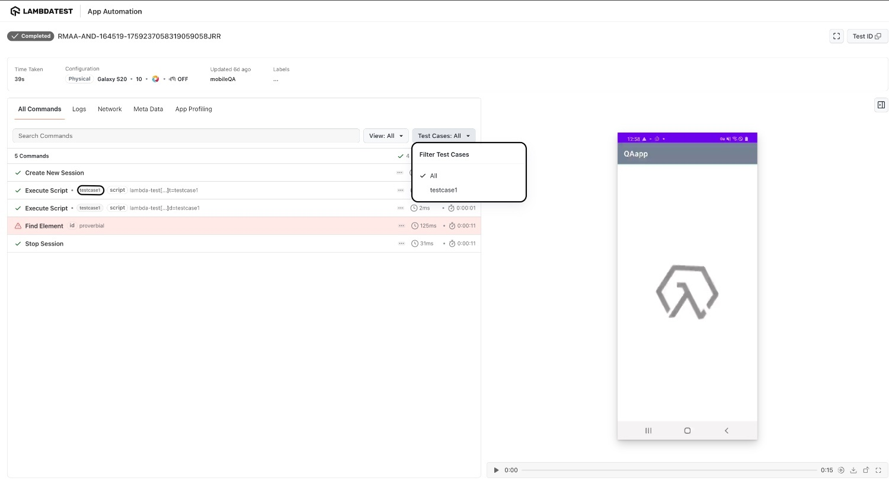
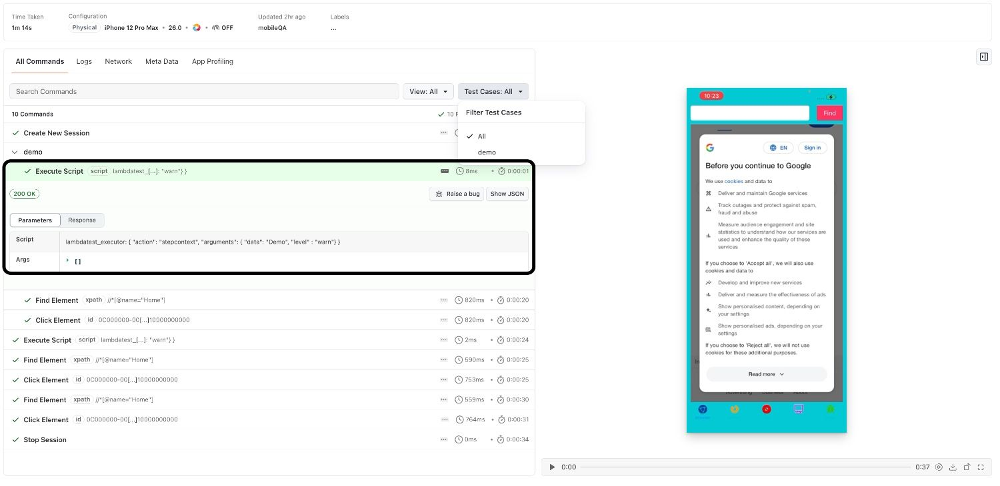

<script type="application/ld+json"
      dangerouslySetInnerHTML={{ __html: JSON.stringify({
       "@context": "https://schema.org",
        "@type": "BreadcrumbList",
        "itemListElement": [{
          "@type": "ListItem",
          "position": 1,
          "name": "Home",
          "item": "https://www.lambdatest.com"
        },{
          "@type": "ListItem",
          "position": 2,
          "name": "Support",
          "item": "https://www.lambdatest.com/support/docs/"
        },{
          "@type": "ListItem",
          "position": 3,
          "name": "LambdaTest Hooks for Appium",
          "item": "https://www.lambdatest.com/support/docs/appium-lambdatest-hooks/"
        }]
      })
    }}
></script>

import CodeBlock from '@theme/CodeBlock';
import {YOUR_LAMBDATEST_USERNAME, YOUR_LAMBDATEST_ACCESS_KEY} from "@site/src/component/keys";

import Tabs from '@theme/Tabs';
import TabItem from '@theme/TabItem';


This document will help you provide lambdahooks which can be used to improve your test scripts to easily debug your test cases for **App Automation on Real Devices** on **LambdaTest Cloud**.

## Adding custom status & remark

To add custom status & remark, just add the code snippet using the ```JavascriptExecutor```.

```JavascriptExecutor``` accepts two arguments as shown below:

Arguments | Example
------------- | -----------------------------------------------------------------------------------------
```status``` | ```failed``` OR ```passed```
```remark``` | Any remark can be added here limited to 255 characters.

```java
((JavascriptExecutor) driver).executeScript("lambda-hook: {\"action\": \"setTestStatus\",\"arguments\": {\"status\":\"failed\", \"remark\":\"This is a sample remark for failed test \"}} ");
```

Here is a sample automation script in Java for the sample status & remark. Ensure to update the ```app_url```, ```username``` & ```accesskey``` in the below code.

```java title="android.java"
import io.appium.java_client.AppiumDriver;
import io.appium.java_client.MobileBy;
import io.appium.java_client.MobileElement;
import org.openqa.selenium.JavascriptExecutor;
import org.openqa.selenium.remote.DesiredCapabilities;
import java.net.MalformedURLException;
import java.net.URL;
public class vanilla_android {
    private static AppiumDriver driver;
    public static void main(String args[]) throws MalformedURLException, InterruptedException {

        try {
            DesiredCapabilities capabilities = new DesiredCapabilities();

            capabilities.setCapability("deviceName", "Galaxy S20");
            capabilities.setCapability("platformVersion", "11");
            capabilities.setCapability("platformName", "Android");
            capabilities.setCapability("isRealMobile", true);
            capabilities.setCapability("app", "APP_ID"); //Enter your app url
            capabilities.setCapability("build", "Java Vanilla - Android");
            capabilities.setCapability("name", "Sample Test Java");

            //Enter your Username & Accesskey here:            
            driver = new AppiumDriver(new URL("https://" +userName + ":" + accessKey + "@mobile-hub.lambdatest.com/wd/hub"), capabilities); 

            MobileElement color = (MobileElement) driver.findElement(MobileBy.id("com.lambdatest.proverbial:id/color"));
            color.click();

            //Javascript Executor for marking the status and custom remark.
            //highlight-next-line
            ((JavascriptExecutor) driver).executeScript("lambda-hook: {\"action\": \"setTestStatus\",\"arguments\": {\"status\":\"failed\", \"remark\":\"This is a sample remark for failed test \"}} ");
        }
        // The driver.quit statement is required, otherwise the test continues to execute, leading to a timeout.
        driver.quit();
    }
}
```

Once you have added the code snippet, the status and remark will be visible on the [LambdaTest App Automation Dashboard](https://appautomation.lambdatest.com/build) as shown below:


## Update Test Name
---

To update the name of the test, just add the code snippet using the ```JavascriptExecutor```.

Arguments | Example
------------- | -----------------------------------------------------------------------------------------
```lambda-name``` | For changing the Test Name.

```bash
((JavascriptExecutor) driver).executeScript("lambda-name=TestName");
```

## Differentiating Test Cases in Single Session
---

LambdaTest has introduced a LambdaHook to help automation engineers differentiate between multiple test cases within a single Appium session. This feature aims to improve debugging capabilities, making it easier to identify which test cases may be causing errors or taking longer to execute.

### Adding LambdaHooks

You can use LambdaHooks to start and end a test case within a single Appium session. 

#### Test Case Start

To start a test case, use the `lambda-testCase-start` hook:

```java
// To start a test case
((JavascriptExecutor) driver).executeScript("lambda-testCase-start=find Name");
```

#### Test Case End

To end a test case, use the `lambda-testCase-end` hook:

```java
// To end a test case
((JavascriptExecutor) driver).executeScript("lambda-testCase-end=find Name");
```

### Labeling and Filtering Command Logs

Any command logs executed between `lambda-testCase-start` and `lambda-testCase-end` will be labeled with the name you provide. The name should not exceed `255` characters. 

You can also filter the command logs based on these labels.A screenshot has been provided below, demonstrating the use of labels and how to filter command logs based on them.



<nav aria-label="breadcrumbs">
  <ul className="breadcrumbs">
    <li className="breadcrumbs__item">
      <a className="breadcrumbs__link" target="_self" href="https://www.lambdatest.com">
        Home
      </a>
    </li>
    <li className="breadcrumbs__item">
      <a className="breadcrumbs__link" target="_self" href="https://www.lambdatest.com/support/docs/">
        Support
      </a>
    </li>
    <li className="breadcrumbs__item breadcrumbs__item--active">
      <span className="breadcrumbs__link">
      Mark test status
      </span>
    </li>
  </ul>
</nav>

---

## Command Annotations 

Command Annotations allow you to add metadata and debugging information to your test scripts. They work similarly to LambdaHooks by providing structured logs on the **LambdaTest Automation Dashboard**, making it easier to track test execution, debug failures, and navigate specific test sections.



### Using Command Annotations

#### Annotation Start
```java
driver.execute_script("lambdatest_executor: {\"action\": \"stepcontext\", \"arguments\": {\"data\": \"youtube\", \"level\": \"debug\"}}");
```

**Arguments:**

| Argument | Description |
|----------|-------------|
| `data` | String value representing the information you want to log. |
| `level` | Log severity level. Acceptable values: `info` (default), `debug`, `warn`, `error`. |

#### Annotation End
To close the executor at the end of your script, pass `data` as an empty string:

```java
driver.execute_script("lambdatest_executor: {\"action\": \"stepcontext\", \"arguments\": {\"data\": \"\"}}");
```

:::info
**Mutual exclusivity:** Test case and Command Annotations cannot be used together in the same script. You can only use **one** of them per session.
:::