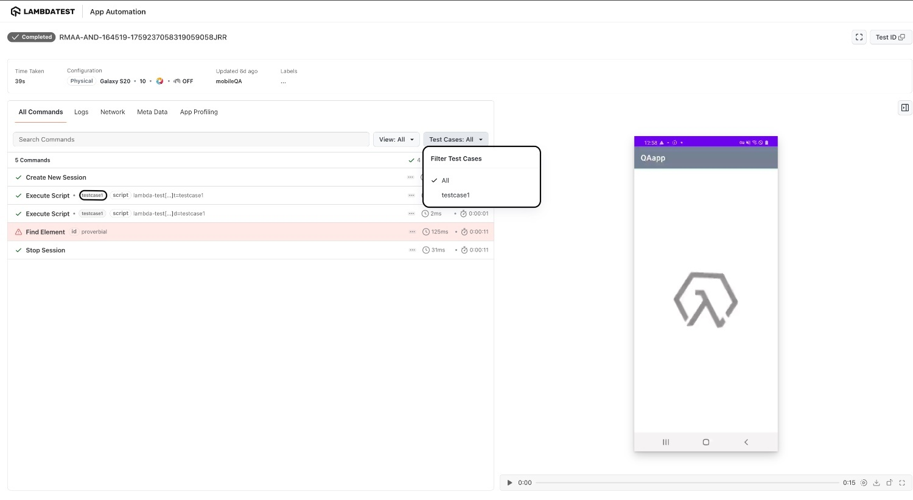
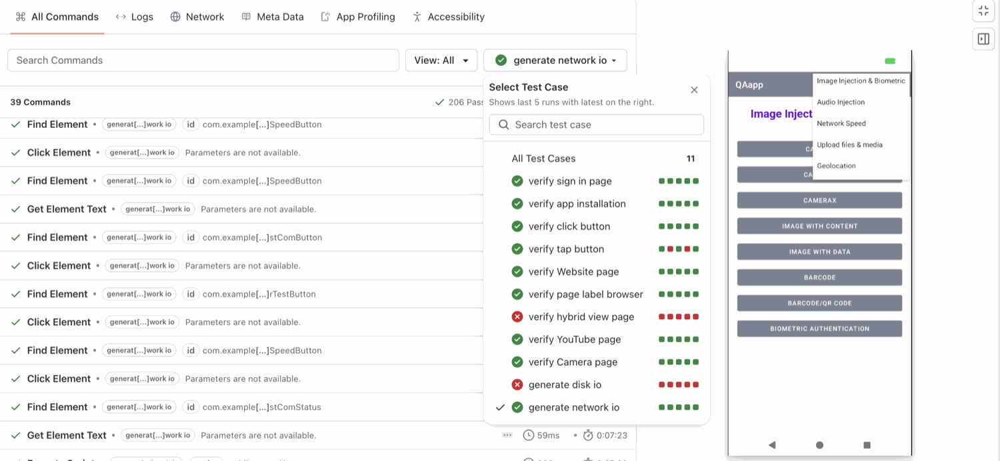
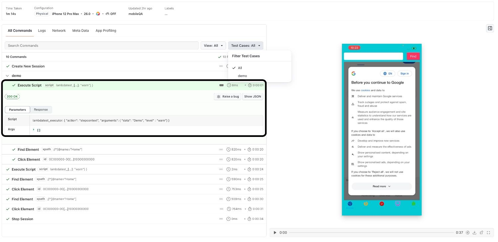

import BrandName, { BRAND_URL } from '@site/src/component/BrandName';


<script type="application/ld+json"
      dangerouslySetInnerHTML={{ __html: JSON.stringify({
       "@context": "https://schema.org",
        "@type": "BreadcrumbList",
        "itemListElement": [{
          "@type": "ListItem",
          "position": 1,
          "name": "Home",
          "item": BRAND_URL
        },{
          "@type": "ListItem",
          "position": 2,
          "name": "Support",
          "item": `${BRAND_URL}/support/docs/`
        },{
          "@type": "ListItem",
          "position": 3,
          "name": "How to Use LambdaHooks for Appium on TestMu AI",
          "item": `${BRAND_URL}/support/docs/appium-testmu-hooks/`
        }]
      })
    }}
></script>

import CodeBlock from '@theme/CodeBlock';
import {YOUR_LAMBDATEST_USERNAME, YOUR_LAMBDATEST_ACCESS_KEY} from "@site/src/component/keys";

import Tabs from '@theme/Tabs';
import TabItem from '@theme/TabItem';

# How to Use LambdaHooks for Appium on TestMu AI
---


LambdaHooks on <BrandName /> are JavaScript-executor snippets you drop into Appium scripts to control and annotate a test run without leaving your own code. Set a status and remarks, rename tests, differentiate cases per session, annotate commands, and install apps.

**Supported on:** Real &amp; Virtual devices

## Adding custom status & remark
---

To add custom status & remark, just add the code snippet using the ```JavascriptExecutor```.

```JavascriptExecutor``` accepts two arguments as shown below:

Arguments | Example
------------- | -----------------------------------------------------------------------------------------
```status``` | ```failed``` OR ```passed```
```remark``` | Any remark can be added here limited to 255 characters.

```java
((JavascriptExecutor) driver).executeScript("lambda-hook: {\"action\": \"setTestStatus\",\"arguments\": {\"status\":\"failed\", \"remark\":\"This is a sample remark for failed test \"}} ");
```

Here is a sample automation script in Java for the sample status & remark. Ensure to update the ```app_url```, ```username``` & ```accesskey``` in the below code.

```java title="android.java"
import io.appium.java_client.AppiumDriver;
import io.appium.java_client.MobileBy;
import io.appium.java_client.MobileElement;
import org.openqa.selenium.JavascriptExecutor;
import org.openqa.selenium.remote.DesiredCapabilities;
import java.net.MalformedURLException;
import java.net.URL;
public class vanilla_android {
    private static AppiumDriver driver;
    public static void main(String args[]) throws MalformedURLException, InterruptedException {

        try {
            DesiredCapabilities capabilities = new DesiredCapabilities();

            capabilities.setCapability("deviceName", "Galaxy S20");
            capabilities.setCapability("platformVersion", "11");
            capabilities.setCapability("platformName", "Android");
            capabilities.setCapability("isRealMobile", true);
            capabilities.setCapability("app", "APP_ID"); //Enter your app url
            capabilities.setCapability("build", "Java Vanilla - Android");
            capabilities.setCapability("name", "Sample Test Java");

            //Enter your Username & Accesskey here:            
            driver = new AppiumDriver(new URL("https://" +userName + ":" + accessKey + "@mobile-hub.lambdatest.com/wd/hub"), capabilities); 

            MobileElement color = (MobileElement) driver.findElement(MobileBy.id("com.lambdatest.proverbial:id/color"));
            color.click();

            //Javascript Executor for marking the status and custom remark.
            //highlight-next-line
            ((JavascriptExecutor) driver).executeScript("lambda-hook: {\"action\": \"setTestStatus\",\"arguments\": {\"status\":\"failed\", \"remark\":\"This is a sample remark for failed test \"}} ");
        }
        // The driver.quit statement is required, otherwise the test continues to execute, leading to a timeout.
        driver.quit();
    }
}
```

Once you have added the code snippet, the status and remark will be visible on the [<BrandName /> App Automation Dashboard](https://www.testmuai.com/login/?redirectTo=https://appautomation.lambdatest.com/build) as shown below:


## Update Test Name
---

To update the name of the test, just add the code snippet using the ```JavascriptExecutor```.

Arguments | Example
------------- | -----------------------------------------------------------------------------------------
```lambda-name``` | For changing the Test Name.

```bash
((JavascriptExecutor) driver).executeScript("lambda-name=TestName");
```

## Differentiating Test Cases in Single Session
---

<BrandName /> has introduced a LambdaHook to help automation engineers differentiate between multiple test cases within a single Appium session. This feature aims to improve debugging capabilities, making it easier to identify which test cases may be causing errors or taking longer to execute.

### Adding LambdaHooks

You can use LambdaHooks to start and end a test case within a single Appium session. 

#### Test Case Start

To start a test case, use the `lambda-testCase-start` hook:

```java
// To start a test case
((JavascriptExecutor) driver).executeScript("lambda-testCase-start=find Name");
```

#### Test Case End

To end a test case, use the `lambda-testCase-end` hook:

```java
// To end a test case
((JavascriptExecutor) driver).executeScript("lambda-testCase-end=find Name");
```

### Labeling and Filtering Command Logs

Any command logs executed between `lambda-testCase-start` and `lambda-testCase-end` will be labeled with the name you provide. The name should not exceed `255` characters. 

You can also filter the command logs based on these labels.A screenshot has been provided below, demonstrating the use of labels and how to filter command logs based on them.



### Viewing Test Cases and Their Trends

Every test case you mark with the start and end hooks is also listed on the automation session details page. Click the test case selector above the command logs to open the **Select Test Case** panel, which lists all the test cases recorded in the session along with the trend of their last five runs.



The panel shows the following details:

| Detail | Description |
|--------|-------------|
| **All Test Cases** | The list of every test case captured between the `lambda-testCase-start` and `lambda-testCase-end` hooks, along with the total count of test cases in the session. |
| **Search test case** | Search for a test case using the name you passed to the hook. This is helpful when a single session runs a large number of test cases. |
| **Status** | A green tick indicates that the test case passed in the current session and a red cross indicates that it failed. |
| **Last 5 runs** | The strip of squares next to each test case shows the result of its last five runs, with the latest run on the right. Green denotes a passed run and red denotes a failed run. |

Selecting a test case from the panel filters the command logs to the commands executed between that test case's start and end hooks, so you can jump straight to the section of the session you want to debug.

:::tip
The **Last 5 runs** trend lets you tell a genuinely broken test case from a flaky one without opening older sessions. A test case that is red across all five runs points to a consistent failure, whereas a mix of red and green points to flakiness that is worth investigating separately.
:::

## Command Annotations 
---

Command Annotations allow you to add metadata and debugging information to your test scripts. They work similarly to LambdaHooks by providing structured logs on the **<BrandName /> Automation Dashboard**, making it easier to track test execution, debug failures, and navigate specific test sections.



### Using Command Annotations

#### Annotation Start
```java
driver.execute_script("lambdatest_executor: {\"action\": \"stepcontext\", \"arguments\": {\"data\": \"youtube\", \"level\": \"debug\"}}");
```

**Arguments:**

| Argument | Description |
|----------|-------------|
| `data` | String value representing the information you want to log. |
| `level` | Log severity level. Acceptable values: `info` (default), `debug`, `warn`, `error`. |

#### Annotation End
To close the executor at the end of your script, pass `data` as an empty string:

```java
driver.execute_script("lambdatest_executor: {\"action\": \"stepcontext\", \"arguments\": {\"data\": \"\"}}");
```

:::info
**Mutual exclusivity:** Test case and Command Annotations cannot be used together in the same script. You can only use **one** of them per session.
:::

## Install and Uninstall App Hooks
---


<BrandName /> now allows you to install and uninstall apps in the middle of your automated tests. This means you don’t need to restart the session every time you want to switch apps, upgrade them, or clean up the device. <BrandName /> enables you to install and uninstall applications during automation test execution by using commands that can be run through WebDriver's script execution functionality.

### Install App

You can install apps uploaded to the <BrandName /> platform directly within your automation scripts using the `lambda-install-app` command followed by the app’s ID. This ID can be either the <BrandName />-generated ID or a custom ID assigned during upload.

**Python example:**
```python
driver.execute_script("lambda-install-app=myApp")
driver.execute_script("lambda-install-app=lt://APP100000000123456789123456789")
```

**JavaScript example:**
```javascript
await browser.execute("lambda-install-app", {
  /* Change the App URL */
  appUrl: "lt://APP1234567890ABCDEF1234567890",
  /* Optional */
  retainData: true
});
```

### Uninstall App

You can uninstall apps during the execution of an automation test using the command `lambda-uninstall-app` followed by the app's package name (for Android apps) or bundle ID (for iOS apps).

**Python example:**
```python
driver.execute_script("lambda-uninstall-app=com.myApp.beta")
driver.execute_script("lambda-uninstall-app=com.apple.myApp")
```

**JavaScript example:**
```javascript
/* Change the App ID */
const APP_ID = "com.lambdatest.proverbial";
await browser.execute(`lambda-uninstall-app=${APP_ID}`);
```

### Test App Upgrades with Hooks

Testing app upgrades is important because users often update to the latest version instead of reinstalling the app. To ensure existing user data is preserved and the app continues to function properly after an upgrade, you can use the following hooks:

**Python example:**

<Tabs className="docs__val">
<TabItem value="macos-file" label="Android" default>

<div className="lambdatest__codeblock">
<CodeBlock className="language-bash">

```python
# Payload required to retain app data while uninstalling it
data = {
  "appPackage": "sampleapp.android.app",
  "retainData": True
}

driver.execute_script("lambda-uninstall-app", data)

# Payload required to reuse data of the old app while installing the new one
data = {
  "appUrl": "lt://APPID",
  "retainData": True
}
driver.execute_script("lambda-install-app", data)
```
</CodeBlock>
</div>

</TabItem>

<TabItem value="windows-file" label="iOS" default>
<div className="lambdatest__codeblock">
<CodeBlock className="language-powershell">

```python
# Send the current app in background
driver.background_app(-1)


# Payload required while installing the new upgrade 
data = {
  "appUrl": "lt://APPID",
  "retainData": True
}
driver.execute_script("lambda-install-app", data)

# Note : In case of enterprise app, user have to pass the below payload 
data = {
  "appUrl": "lt://APPID",
  "resignApp": False,
  "retainData": True
}

```
</CodeBlock>
</div>
</TabItem>


</Tabs>

### Validation Errors

You might encounter some errors while using these features. The following are some common validation errors and their meaning:

| Error Message                                  | Meaning                                                        |
| --------------------------------------------------- | -------------------------------------------------------------- |
| `No app_url has been provided for lambda-install-app. Please check and try again.`| The install command is missing the app URL or ID.              |
| `The app provided for lambda-install-app is not accessible. Please check and try again.`| The app ID does not belong to your account or is inaccessible. |
| `Failed to fetch app details.`                      | The app ID is invalid or app is not found.                     |
| `Failed to install the app using lambda-install-app.`  | Installation failed due to compatibility or other issues.      |
| `No app package or app bundle id has been provided for lambda-uninstall-app. Please check and try again.` | The uninstall command is missing the app package or bundle ID. |
| `Failed to uninstall the app using lambda-uninstall-app.`| Uninstallation failed; app may not be installed or wrong ID.|

Multiple errors may occur based on the scenario. Understanding these errors will help you identify and resolve issues more efficiently, ensuring smooth test execution. Once the code snippets are added, the tests can be executed and will appear on the [<BrandName /> App Automation Dashboard](https://www.testmuai.com/login/?redirectTo=https://appautomation.lambdatest.com/build).

> **Note:** If the user had enabled any of the following capabilities in the previously installed app, they will remain available and functional in the upgraded app as well : `EnableScreenshotUnblock`,`EnableImageInjection`,`EnableVideoInjection`,`Network`,`AppProfiling`,`EnableWebContentsDebugging`,`EnableBiometricInjection`.This ensures that key testing features continue to work seamlessly after the app is updated, without requiring additional configuration.

## Next Steps
---

Continue with these related guides:

- [Run your first Appium test](/support/docs/getting-started-with-appium-testing/)
- [Appium automation capabilities](/support/docs/desired-capabilities-in-appium/)
- [Upload apps to the real device cloud](/support/docs/application-setup-via-api/)
- [App Automation Dashboard](/support/docs/app-automation-dashboard/)

<nav aria-label="breadcrumbs">
  <ul className="breadcrumbs">
    <li className="breadcrumbs__item">
      <a className="breadcrumbs__link" target="_self" href={BRAND_URL}>
        Home
      </a>
    </li>
    <li className="breadcrumbs__item">
      <a className="breadcrumbs__link" target="_self" href={`${BRAND_URL}/support/docs/`}>
        Support
      </a>
    </li>
    <li className="breadcrumbs__item breadcrumbs__item--active">
      <span className="breadcrumbs__link">
        How to Use LambdaHooks for Appium on TestMu AI
      </span>
    </li>
  </ul>
</nav>
