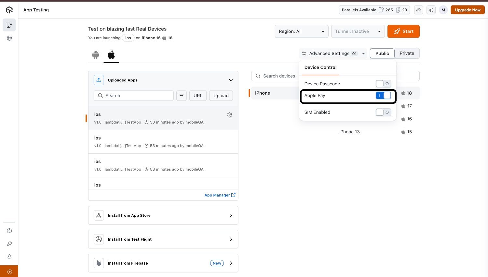
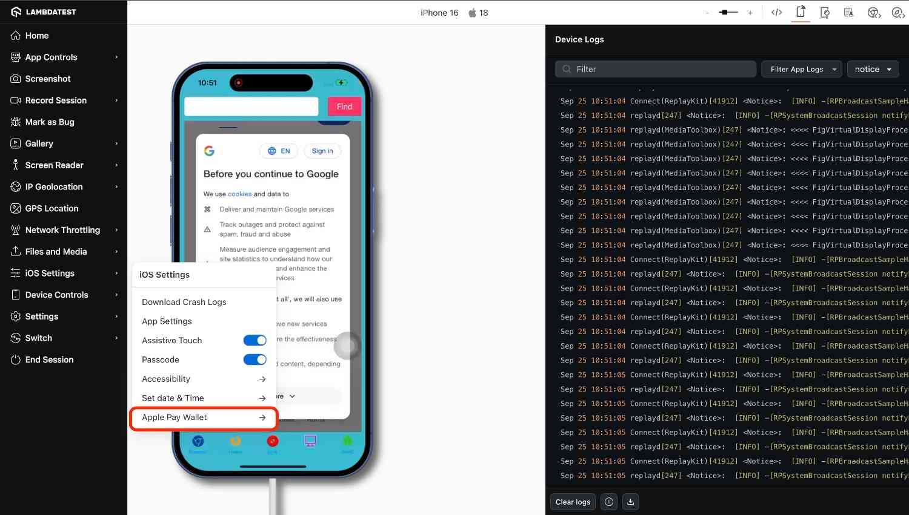
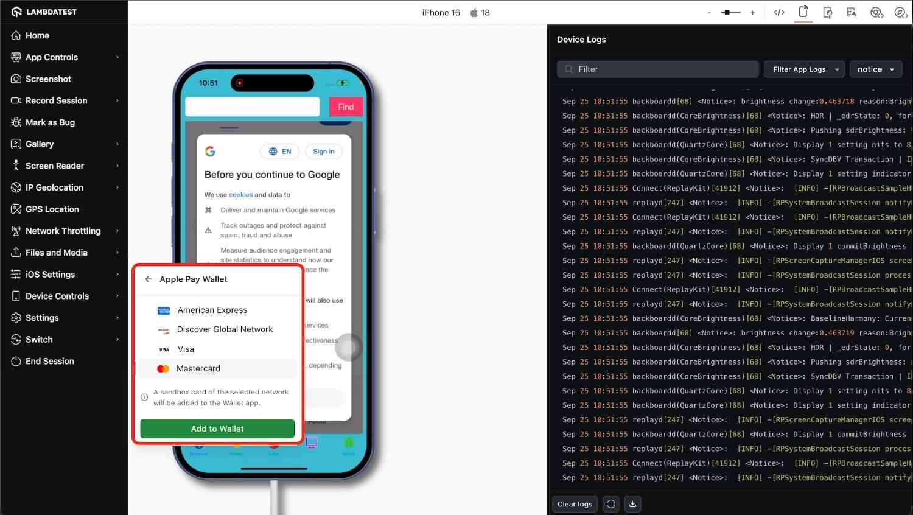
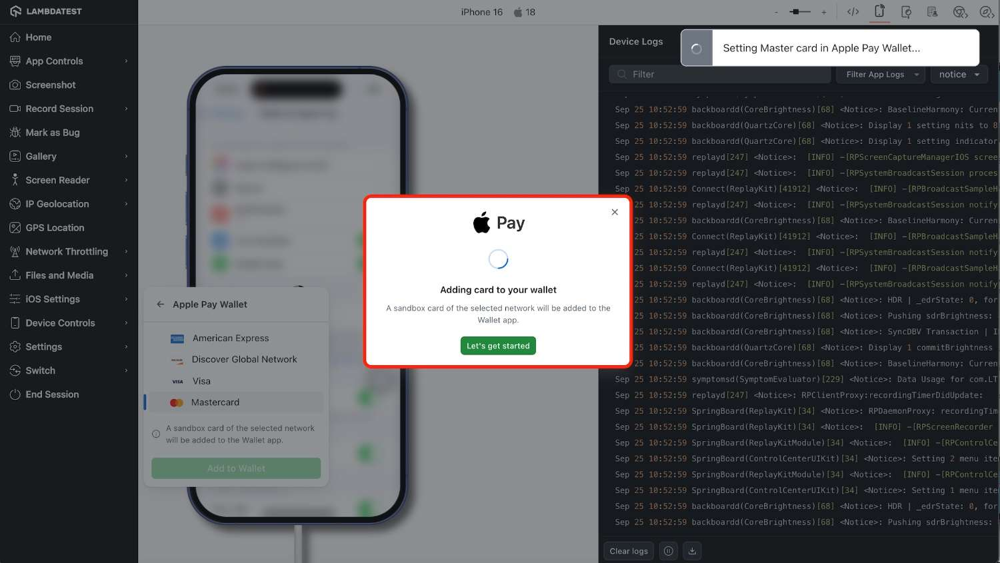

import CodeBlock from '@theme/CodeBlock';
import Tabs from '@theme/Tabs';
import TabItem from '@theme/TabItem';

import BrandName, { BRAND_URL } from '@site/src/component/BrandName';

# Apple Pay Testing on Real Devices

**Apple Pay** is Apple’s secure digital wallet and payment system that enables in-app and web purchases with an extra layer of protection. Testing of Apple Pay is essential to validate the user experience, including wallet selection, passcode entry, and transaction confirmation.

With <BrandName /> App Live, you can test Apple Pay flows on **Real iOS Devices**. This guide walks you through enabling Apple Pay, configuring wallets, running the application, and completing transactions manually.

> To enable it for your organization, please contact us via  window.openLTChatWidget()}>**24×7 chat support** or you can also drop a mail to **support@testmuai.com**. 

---

## Use Cases

- **Manual Checkout Testing**: Ensure Apple Pay works correctly across different devices.
- **Wallet Verification**: Confirm users can select the correct card type (Visa, MasterCard, etc.).
- **Passcode Flow**: Validate that passcode entry and Assistive Touch work as expected.
- **End-to-End Transaction Confirmation**: Simulate real user behavior to confirm Apple Pay transactions.

---

## Supported Devices

Currently, Apple Pay manual testing in App Live is supported on these iOS real devices:

| iOS Device   | iOS Version |
|--------------|-------------|
| iPhone 16    | 18          |
| iPhone 15    | 17          |
| iPhone 14    | 16          |
| iPhone 13    | 15          |

> We are actively working on expanding coverage to **all supported iOS devices** on <BrandName /> Real Device Cloud.

---

## Manual Apple Pay Workflow in App Live

### Step 1: Enable Apple Pay in Advanced Settings

1. Open **App Live** and select your desired iOS device.
2. Navigate to **Advanced Settings**.
3. Locate the **Apple Pay** toggle and enable it, and confirm the device selection accordingly.
   - 

---

### Step 2: Configure Wallet

1. Within the app, select the option to configure **Wallet** inside iOS settings.
  
2. User can choose any of the four options: **American Express**, **Visa**, **MasterCard**, **Discover Global Network**.
 
4. Wait 1–3 minutes for Apple Pay to configure.

---
### Step 4: Use Apple Pay in App Live

Within the App Live session, you can use Apple Pay via the **Assistive Touch** option. Simply click on Apple Pay, and you will be prompted to enter the device passcode (default is `123456`). Once the passcode is entered, you can complete a payment through Apple Pay, simulating a real user transaction.

:::info
- If the **Wallet** is not set up on the device, the **Apple Pay** option will not appear through **Assistive Touch**. Please ensure Wallet is configured before attempting to access Apple Pay.
:::
---

## Additional Links

- [Apple Pay Demo Website](https://developer.apple.com/apple-pay/sandbox-testing/)
- [<BrandName /> App Live Overview](https://www.lambdatest.com/app-live)
- [iOS Assistive Touch Guide](https://support.apple.com/guide/iphone/assistive-touch-iph3e2e4157/ios)

---

:::tip
Within a single session, only one card can be selected. To switch cards, you’ll need to start a new session with the desired card. 
:::
