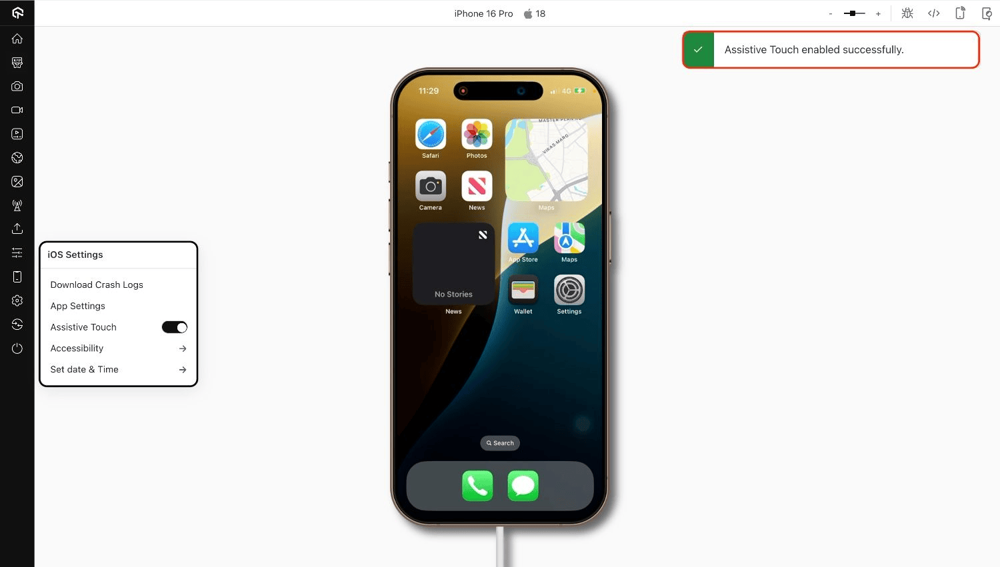
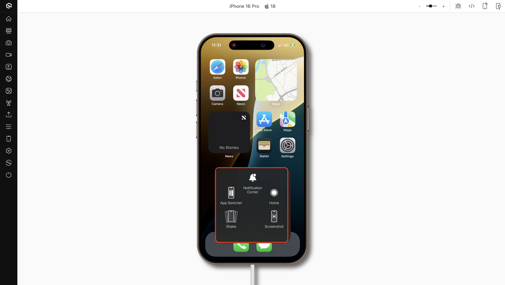

import CodeBlock from '@theme/CodeBlock';
import { YOUR_LAMBDATEST_USERNAME, YOUR_LAMBDATEST_ACCESS_KEY } from "@site/src/component/keys";

import Tabs from '@theme/Tabs';
import TabItem from '@theme/TabItem';
import BrandName, { BRAND_URL } from '@site/src/component/BrandName';

> To enable it for your organization, please contact us via  window.openLTChatWidget()}>**24×7 chat support** or you can also drop a mail to **support@testmu.ai**. 

<BrandName />'s **Assistive Touch** feature enables you to perform key system-level actions directly from the testing toolbar during manual sessions on real iPhones and iPads.  
This allows you to replicate gestures such as going to the Home Screen, opening the Notification Center, taking screenshots, and more without relying on physical device buttons or gestures.

## Use Cases

- Navigate to the Home Screen after completing a flow (e.g., logout, relaunch).
- Open the Notification Center to test notification-related workflows.
- Switch between apps to validate background/foreground behavior.
- Capture screenshots for UI validation or bug reporting.
- Simulate a shake gesture to test motion-based features.

## Supported Devices

| Device Type | Supported OS Version |
|-------------|----------------------|
| iPhone      | iOS 14 and above     |
| iPad        | iPadOS 14 and above  |

## Supported Actions

| Action | Description |
|--------|-------------|
| **Home Button** | Returns to the Home Screen. |
| **Notification Center** | Pulls down the system notification tray. |
| **App Switcher** | Opens multitasking to switch or close apps. |
| **Screenshot** | Captures the current screen. |
| **Shake Gesture** | Simulates device shake for undo or motion triggers. |

## Using Assistive Touch in Manual Testing

**Step 1:** Start a manual testing session on a real iOS device in **App Live** or **Browser Live**.

**Step 2:** From the session toolbar, open the **iOS Settings** panel and toggle **Assistive Touch on** .

**Step 3:** Tap the Assistive Actions icon to open the gesture menu, then select the desired action to simulate it on the device

