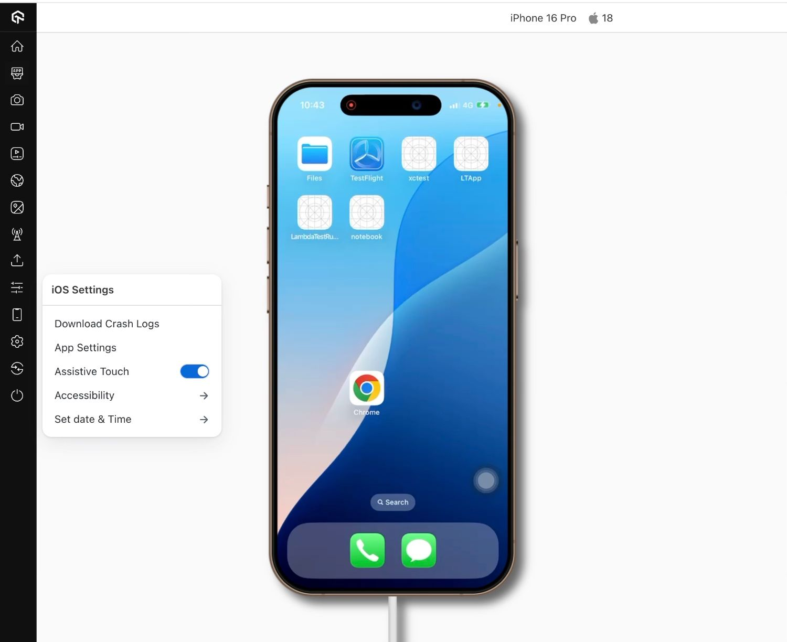

import CodeBlock from '@theme/CodeBlock';
import { YOUR_LAMBDATEST_USERNAME, YOUR_LAMBDATEST_ACCESS_KEY } from "@site/src/component/keys";

import Tabs from '@theme/Tabs';
import TabItem from '@theme/TabItem';

LambdaTest's **Assistive Touch** feature enables you to perform key system-level actions directly from the testing toolbar during manual sessions on real iPhones and iPads.  
This allows you to replicate gestures such as going to the Home Screen, opening the Notification Center, taking screenshots, and more without pressing physical device buttons.

## Use Cases

- Navigate to the Home Screen after completing a flow (e.g., logout, relaunch).
- Open the Notification Center to test notification-related workflows.
- Switch between apps to validate background/foreground behavior.
- Capture screenshots for UI validation or bug reporting.
- Simulate a shake gesture to test motion-based features.

## How It Works

Assistive Touch uses LambdaTest’s on-device instrumentation to emulate native iOS gestures via a simple **Assistive Actions** panel.  
When triggered, each action behaves exactly as it would on a physical device, allowing accurate test scenarios without manual button presses.

### Key Features

- Works on **iPhones and iPads running iOS/iPadOS 14 and above**.
- Five pre-set system actions: Home, Notification Center, App Switcher, Screenshot, Shake Gesture.
- One-click trigger from the **App Live** toolbar.
- Hover tooltips (desktop) and toast confirmations for every action.
- Auto-disable unsupported actions with a “Not supported on this device” message.

## Supported Actions

| Action | Description |
|--------|-------------|
| **Home Button** | Returns to the Home Screen. |
| **Notification Center** | Pulls down the system notification tray. |
| **App Switcher** | Opens multitasking to switch or close apps. |
| **Screenshot** | Captures the current screen. |
| **Shake Gesture** | Simulates device shake for undo or motion triggers. |

## Using Assistive Touch in Manual Testing

**Step 1:** Start a manual testing session on a real iOS device in **App Live** or **Browser Live**.

**Step 2:** From the session toolbar, open the Settings panel and toggle Assistive Actions ON.

**Step 3:** Tap Assistive Actions to view the available system gestures.

**Step 4:** Choose the desired action icon to trigger:
- 🏠 Home  
- 🔔 Notification Center  
- 🔄 App Switcher  
- 📸 Screenshot  
- 📳 Shake Gesture  

**Step 5:** Look for the **toast notification** confirming the action.

:::info
If an action isn’t supported on your OS version, it will appear disabled with the message *"Not supported on this device."*
:::

