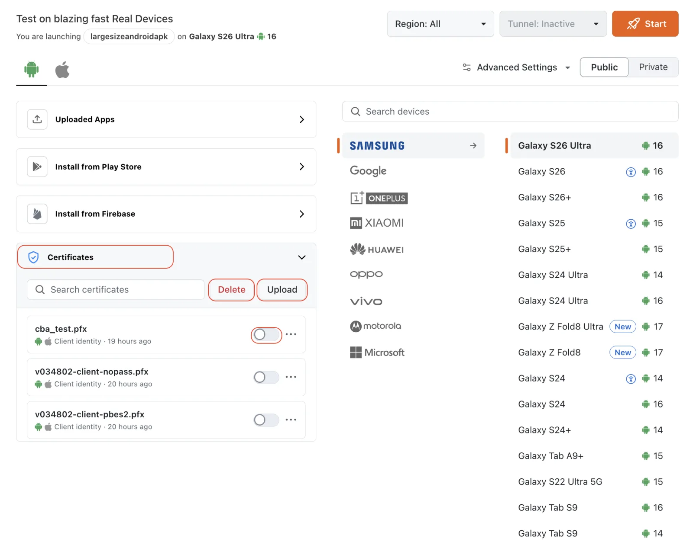
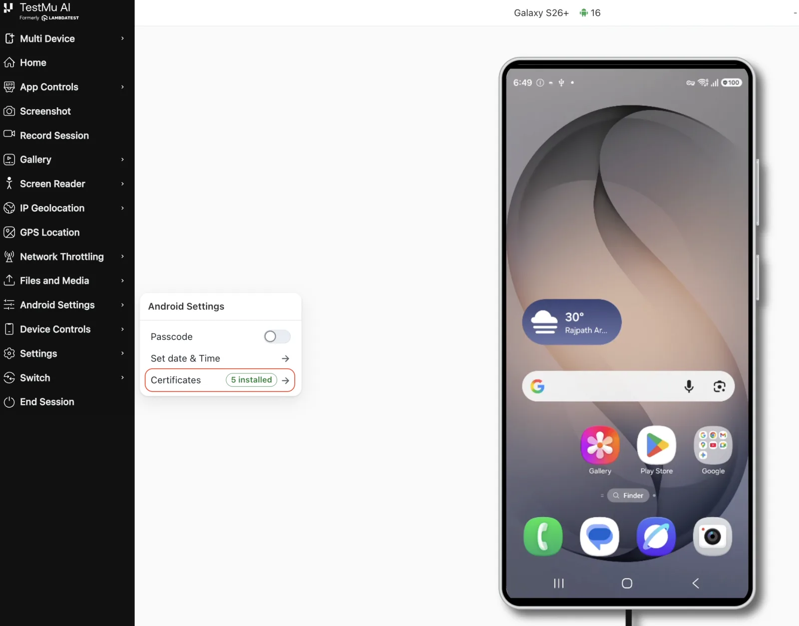
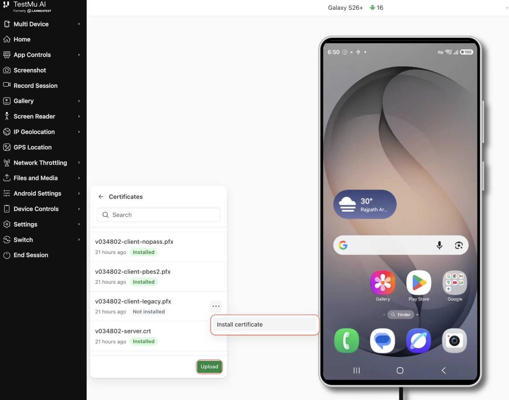

import Tabs from '@theme/Tabs';
import TabItem from '@theme/TabItem';
import RealDeviceTag from '../src/component/realDevice';
import BrandName, { BRAND_URL } from '@site/src/component/BrandName';


<script type="application/ld+json"
      dangerouslySetInnerHTML={{ __html: JSON.stringify({
       "@context": "https://schema.org",
        "@type": "BreadcrumbList",
        "itemListElement": [{
          "@type": "ListItem",
          "position": 1,
          "name": "Home",
          "item": BRAND_URL
        },{
          "@type": "ListItem",
          "position": 2,
          "name": "Support",
          "item": `${BRAND_URL}/support/docs/`
        },{
          "@type": "ListItem",
          "position": 3,
          "name": "Certificate Injection on Real Devices",
          "item": `${BRAND_URL}/support/docs/certificate-injection-on-realdevice/`
        }]
      })
    }}
></script>

<RealDeviceTag value="Real Device" />

Many apps connect to servers that use certificates issued by a private or corporate certificate authority. Some apps also pin a **self-signed certificate**, or present a **client certificate** to authenticate themselves before a server will respond. On a standard device, these connections fail because the device does not trust your organization's certificates.

<BrandName />'s **Certificate Injection** allows you to upload your own certificates and install them on a real device during a manual App Testing session. Your app then behaves on the <BrandName /> cloud exactly as it does on your internal network. Certificates are installed for a single session and are removed when the session ends.

---

## Use Cases

- Test apps that use **self-signed certificates** in development and staging environments.
- Verify app behavior when **SSL pinning** is enabled, and debug related network issues.
- Test **mutual TLS (mTLS)** login flows where your app must present a client certificate.
- Access **internal or pre-production endpoints** signed by a corporate certificate authority, without disabling TLS validation in your build.

---

## Availability

| | |
|---|---|
| **Device type** | Real devices only |
| **Platforms** | Android and iOS |
| **Session types** | App Testing (Manual) and App Automation |
| **Certificates per session** | Up to 3 |
| **Maximum file size** | 15 MB per certificate |

:::note Enablement Required
Certificate Injection is enabled per organization. If the **Certificates** section is not visible on your dashboard, the feature is not yet switched on for your account.

To unlock this feature, please contact your <BrandName /> support representative, reach out to our <span className="doc__lt" onClick={() => window.openLTChatWidget()}>**[24×7 Chat Support]**</span>, or email us at **support@testmuai.com**.
:::

:::warning
Certificate Injection applies to **app testing** sessions on **real devices**. It is not available on virtual devices or emulators, and it is not supported in real device **browser** testing sessions.
:::

---

## Supported Certificate Formats

The file extension determines how a certificate is installed, so make sure you upload it with the extension that matches its contents.

| Extension | What it is | Installs as | Platform | Password |
|---|---|---|---|---|
| `.crt` `.cer` | A CA or server certificate | Trusted CA certificate | Android, iOS | Not used |
| `.pfx` | A PKCS#12 bundle containing a private key and its certificate chain | Client identity, granted to the app under test | Android, iOS | Required |
| `.mobileconfig` | An Apple configuration profile | Installed profile | iOS only | Not used |

:::note
Android does not have an equivalent of an Apple configuration profile, so a `.mobileconfig` file can only be used in an iOS session.
:::

---

## Upload Certificates Before a Test Session

Certificates are saved to your account and reused across sessions, so you only need to upload each certificate once.

**Step 1:** Open the **App Testing** dashboard and select the app and device you want to launch.

**Step 2:** In the left panel, expand the **Certificates** section. It appears below your app sources: **Uploaded Apps**, **Install from Play Store**, and **Install from Firebase**.

**Step 3:** Click **Upload** and select the certificate file from your machine. If you are uploading a `.pfx` bundle, enter its password. The password is stored securely against the certificate, so you do not need to enter it again for later sessions.

**Step 4:** Turn on the **toggle** next to each certificate you want installed for this session. You can select up to **3 certificates per session**.

**Step 5:** Click **Start** to launch the session. The selected certificates are installed on the device as the session starts.



Each certificate in the list shows the platforms it applies to, what it installs as (for example, **Client identity** for a `.pfx` bundle), and when it was uploaded. Use **Search certificates** to find a certificate quickly.

:::info
If a certificate fails to install, the session **still starts**. Each certificate reports its own status, so you can check which ones installed successfully before you begin testing.
:::

---

## Manage Certificates During a Test Session

You can also manage certificates inside a running session. This allows you to check which certificates are installed, install one that you did not enable at launch, and upload a new certificate without restarting the session.

**Step 1:** In the session sidebar, open **Android Settings** (or **iOS Settings** on an iOS device) and click **Certificates**. The badge shows how many certificates are currently installed on the device.



**Step 2:** The **Certificates** panel lists your uploaded certificates, with an **Installed** or **Not installed** status next to each one.

**Step 3:** To install a certificate that is not yet on the device, click the **⋯** menu next to it and select **Install certificate**.

**Step 4:** To add a new certificate, click **Upload** at the bottom of the panel and select the file. The certificate is added to your account and can be installed immediately.



:::tip
Use the **Search** field at the top of the panel to find a certificate quickly if your account has a long list.
:::

---

## Delete Uploaded Certificates

Certificates remain on your account until you remove them. To delete a certificate, open the **Certificates** section on the App Testing dashboard, select the certificate, and click **Delete**.

Deleting a certificate only removes it from your account. It does not affect a session that is already running.

---

## What Happens on the Device

The behavior differs by platform, because Android and iOS handle certificate trust differently.

<Tabs className="docs__val">
  <TabItem value="android" label="Android" default>

- A **CA certificate** is added to the device's user trust store, under a name derived from your filename. Existing trusted certificates on the device are not removed.
- A **PKCS#12 identity** is installed into the device keystore and then granted to the app under test. On Android, an app cannot access a key unless it has been granted access to it.

To confirm that a CA certificate is present, go to **Settings** > **Security** > **Encryption & credentials** > **Trusted credentials** > **User** on the device during your session.

:::warning Android Apps Must Opt In to User CAs
Since **Android 7**, an app trusts user-installed CA certificates only if its network security configuration allows it. Installing the CA on the device is **not enough on its own**. If your app uses the default configuration, it will still reject the connection.

In the build you are testing, add a `network_security_config.xml` file that trusts the `user` certificate store:

```xml
<network-security-config>
    <base-config>
        <trust-anchors>
            <certificates src="system" />
            <certificates src="user" />
        </trust-anchors>
    </base-config>
</network-security-config>
```
:::

  </TabItem>
  <TabItem value="ios" label="iOS">

- Certificates are delivered to the device as a **managed configuration profile**, installed and trusted without any manual step on the device.
- A `.mobileconfig` file keeps its own identifier and payload, so a profile that you have already validated in your own environment behaves the same way here.

To confirm that a profile is present, go to **Settings** > **General** > **VPN & Device Management** on the device during your session.

:::note
Installation is asynchronous on iOS, so a certificate may briefly show as **pending**. This means the device management channel has accepted it, but the device has not confirmed it yet. The status updates automatically shortly after the session starts.
:::

  </TabItem>
</Tabs>

---

## Limits and Rules

| Rule | Value |
|---|---|
| Certificates per session | **3** |
| Certificate file size | **15 MB** |
| Device type | Real devices only. Not available on virtual devices or emulators |
| Session type | App testing sessions only. Not supported in real device browser testing |
| Password on `.pfx` | Required at upload time |
| `.mobileconfig` | iOS sessions only |
| Organization entitlement | Must be enabled for your account |

---

## FAQs

**Q: My CA installs successfully but the app still rejects the connection. Why?**

On Android, this is almost always caused by the network security configuration. Since Android 7, apps do not trust user-installed CA certificates unless their `network_security_config.xml` explicitly allows it. The certificate is installed on the device, but your app is not configured to trust it.

Build a test variant that trusts the `user` certificate store, and use that build for these sessions.

**Q: One of my certificates shows as Not installed. What now?**

Open the **Certificates** panel from the session sidebar, click the **⋯** menu next to it, and select **Install certificate**. If it still fails, the most common cause for a `.pfx` bundle is an incorrect password, which prevents the identity from being read. Verify the password by opening the bundle on your local machine, then re-upload the certificate with the correct password.

**Q: Will another customer's session see my certificate?**

No. Certificates are installed for a specific session on a specific device, and are removed when that session ends, including when a session times out or is stopped early. Each device is verified before it returns to the device pool. If a certificate is still present, the device is held back instead of being allocated to another user.

---

## Additional Links

- [Certificate Injection in App Automation on Real Devices](/support/docs/certificate-injection-appautomation/)
- [App Testing on Real Devices](/support/docs/app-testing-on-real-devices/)
- [How to Use Testing Tools in a Session](/support/docs/how-to-use-testing-tools-in-session/)

---

Need help with something this page does not cover, such as an unlisted certificate format, more than three certificates in a session, or a failed installation? Reach out to our <span className="doc__lt" onClick={() => window.openLTChatWidget()}>**[24×7 Chat Support]**</span> or email **support@testmuai.com**.
