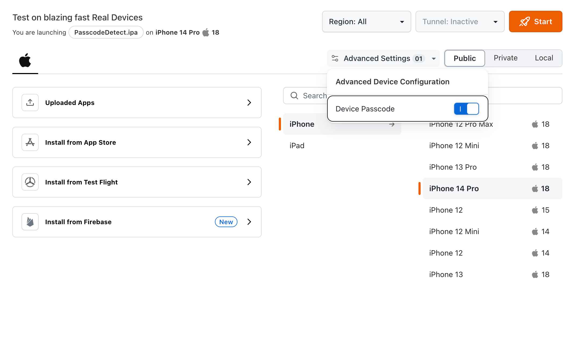
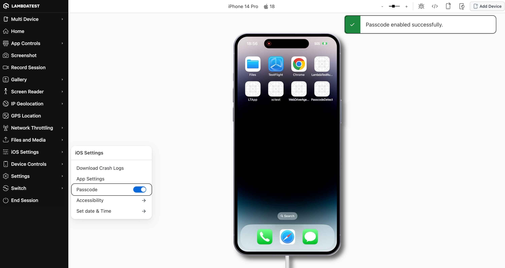
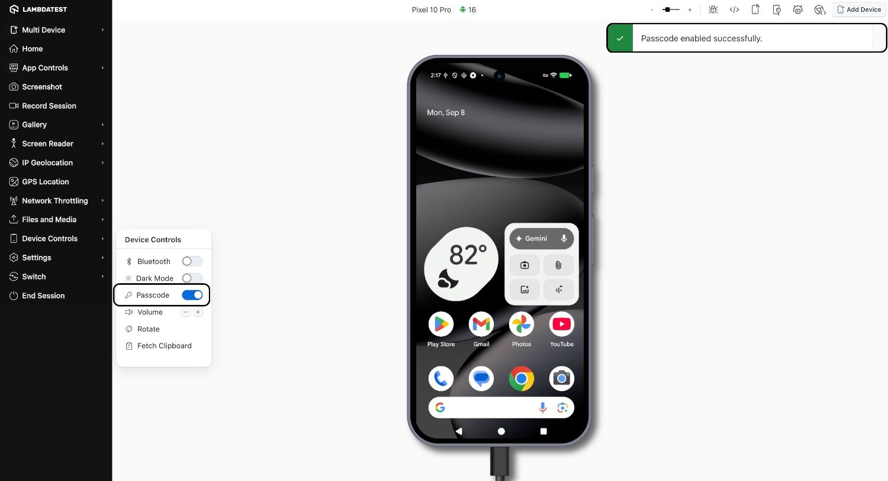

import CodeBlock from '@theme/CodeBlock';
import { YOUR_LAMBDATEST_USERNAME, YOUR_LAMBDATEST_ACCESS_KEY } from "@site/src/component/keys";

import Tabs from '@theme/Tabs';
import TabItem from '@theme/TabItem';

> To enable it for your organization, please contact us via  window.openLTChatWidget()}>**24×7 chat support** or you can also drop a mail to **support@lambdatest.com**. 

LambdaTest’s **Device Passcode** feature allows you to test applications that require a device passcode as part of their security or authentication flow.  
This is especially useful for apps in **Banking/Finance**, **Enterprise**, or those distributed via **MDM (Mobile Device Management)** that mandate passcode entry for sensitive workflows.

## Use Cases

- Verify app behavior when the device requires a passcode for login or secure actions.  
- Test app workflows that trigger a system passcode prompt (e.g., after inactivity, or accessing secure sections).  
- Validate app compliance with enterprise policies that enforce passcodes.  
- Reproduce real-world scenarios for apps with heightened security requirements.

## Supported Devices

### iOS Devices

| Device Model          | iOS Version |
|-----------------------|-------------|
| iPhone 16            | 18 |
| iPhone 16 Pro        | 18 |
| iPhone 15            | 17 |
| iPhone 14            | 16 |
| iPhone 13            | 15 |
| iPad Air 11 (2024)   | 18 |

> We are actively working on expanding coverage to all supported iOS devices on LambdaTest Real Device Cloud.

---

### Android Devices
Available on **all real devices** running on **version 11 and above**.

## Default Passcode
- **iOS:**  `123456`  
- **Android:**  `1234`   

## Accessing Device Passcode in Manual Testing

**Step 1:** (**iOS only**) On the App Testing Dashboard, click **Advanced Settings** and enable the **Device Passcode** filter. This will refine the iOS device list to show only those with passcode support.   

  

**Step 2:** Start a manual testing session on your selected device (iOS or Android).  
- On **iOS** → Open the **iOS Settings** panel and toggle **Passcode** on.  
   
- On **Android** → Open the **Device Controls** panel and toggle **Passcode** on.  
   
Setup may take **15–30 seconds** depending on the platform.

**Step 4:** Trigger the workflow inside your app that requires the device passcode.  
- A system passcode screen will appear.  
- Since passcode entry is sensitive, the keypad or the screen may not be streamed and could appear as black in your session view.  
- Use your system keyboard to enter the default passcode:  
  - iOS: `123456`  
  - Android: `1234`   

**Step 5:** Continue your app testing once the **passcode** is validated.

:::note
- Passcode input is **not visible** in the stream for security reasons.  
- You may experience a blacked-out screen briefly during passcode entry. 
:::
---
