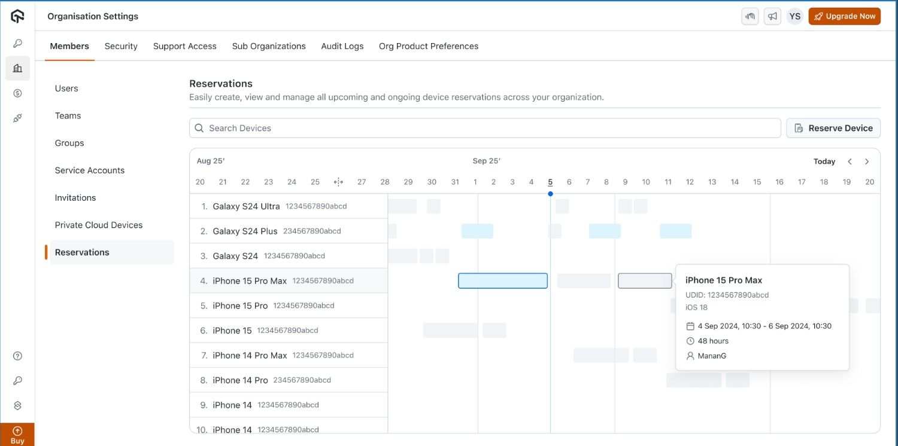

import CodeBlock from '@theme/CodeBlock';
import {YOUR_LAMBDATEST_USERNAME, YOUR_LAMBDATEST_ACCESS_KEY} from "@site/src/component/keys";

import Tabs from '@theme/Tabs';
import TabItem from '@theme/TabItem';

<script type="application/ld+json"
      dangerouslySetInnerHTML={{ __html: JSON.stringify({
       "@context": "https://schema.org",
        "@type": "BreadcrumbList",
        "itemListElement": [{
          "@type": "ListItem",
          "position": 1,
          "name": "Home",
          "item": "https://www.lambdatest.com"
        },{
          "@type": "ListItem",
          "position": 2,
          "name": "Support",
          "item": "https://www.lambdatest.com/support/docs/"
        },{
          "@type": "ListItem",
          "position": 3,
          "name": "Python With Appium",
          "item": "https://www.lambdatest.com/support/docs/appium-python/"
        }]
      })
    }}
></script>

# Device Reservation on Private Cloud Devices

Device Reservation in LambdaTest allows you to **reserve private cloud devices ahead of time** and ensure dedicated access during critical testing windows. By reserving devices in advance, testers can avoid conflicts, eliminate last‑minute interruptions, and guarantee smoother execution of both manual and automated test runs. This capability is especially valuable for time‑sensitive releases, large regression cycles, and continuous integration pipelines, where uninterrupted device availability is crucial. Beyond conflict prevention, it also helps organizations improve overall resource utilization, enforce fair usage policies, and provide better visibility of device allocation across teams.

---

## Use Cases 

- **Release-Day Reliability**: Reserve devices in advance to guarantee uninterrupted testing during production releases or hotfix rollouts.  
- **Parallel Test Execution**: Secure multiple devices for running automated test suites in parallel, speeding up regression cycles.  
- **Cross-Team Coordination**: Schedule device bookings across QA, Dev, and Ops teams to align on shared testing timelines.  
- **Peak Hour Management**: Prevent conflicts during high-demand periods by ensuring fair access and availability through reservations.  
- **Optimized Resource Utilization**: Track and manage reservations to avoid idle devices and maximize the ROI of your private cloud setup.

---
# Device Reservation Flow 

## Accessing the App Live Dashboard
1. Open the [App Live Dashboard](https://applive.lambdatest.com/app).
2. Enable the toggle for Private Devices (**Available only for private cloud devices**).
3. You will see two buttons which are **My Reservations** and **Go to Reservations**

:::tip
- My reservations is used for View all your ongoing and upcoming reservations, with filter options to refine the list
- Go to Reservations is used for Opening the calendar view where you can explore and manage device bookings.
:::

## Checking Your Reservations

You can easily track your device bookings:
- Go to **My Reservations** from the App Live Dashboard.
- View all your upcoming and ongoing reservations.
- Use available filters to refine and quickly find the reservations you need.


## Making a Reservation
1. Click Reserve Device.
2. In the reservation window, choose the type of reservation:
   - **Immediate Reservation** – Reserve a device instantly for 1 to 12 hours.
      
   - **Future Reservation** – Schedule a reservation for a later date/time within the allowed scheduling window.
   
3. Select **one or multiple devices** based on availability and your use case.
4. Confirm the reservation.

## Calendar View and Permissions
The **calendar** view works differently for users and admins:
- **Users:**
  - The user view consists of a calendar showcasing blocks along with devices
  - The `blue blocks` are the user own reserved slots and have edit/delete access
  - The `grey blocks` are other team members slot and user does not have any access to edit/delete the same
     
- **Admins:**
  - In addition to the User view, Admins have access to a settings tab
  - Which have access to additional policy controls, such as:
    - **Advance Booking Window** – Define how far in advance users can schedule reservations.
    - **Max Reservation Duration** – Set the maximum duration allowed for a reservation (1–48 hours).
    - **Active Reservations per User** – Limit the number of active reservations per user (1–99).
    - **Devices per Reservation** – Define how many devices can be booked in one reservation.
   
  - Also Admin can create, edit, and delete any reservation.

:::info
For Admin all blocks are blue, as they have access to edit and delete any of the following slots 
:::
## Using Reservations in Automated Testing

To use a reserved device in automation:
1. Create a reservation for your device and note its UUID.
2. In your automation script, add the following capabilities 
        - **fixedIP**: This field accepts the UUID of the reserved device, guaranteeing that your automation session is executed on that specific device rather than any random match.
        - **privateCloud**: Set this to `true` to ensure the session is executed only on your private cloud devices, preventing it from falling back to shared public devices.
<Tabs className="docs__val">
<TabItem value="ios" label="iOS" default>

```python
desired_caps = {
    "deviceName": "iPhone 16",
    "platformName": "iOS",
    "platformVersion": "18",
    "isRealMobile": True,
    "app": "YOUR_APP_URL",
    "build": "Smart Heal iOS",
    "name": "Sample Smart Heal Test",
    # highlight-next-line
    "fixedIP": "UUID",
    # highlight-next-line
    "privateCloud": true
}
```

</TabItem>

<TabItem value="android" label="Android" default>

```python
desired_caps = {
    "deviceName": "Galaxy S25",
    "platformName": "Android",
    "platformVersion": "16",
    "isRealMobile": True,
    "app": "YOUR_APP_URL",
    "build": "Smart Heal Android",
    "name": "Sample Smart Heal Test",
    # highlight-next-line
    "fixedIP": "UUID",
    # highlight-next-line
    "privateCloud": true
}
```

</TabItem>
</Tabs>
This ensures that your automation run is executed on the reserved private cloud device.

## Session Expiry and Extensions
- In the last **15 minutes** of a reservation, a pop-up appears notifying you that the session is about to end.
- If no pre-booked reservation exists for the device, you will have the option to extend your session.
- If another booking is scheduled, the extension option will not appear.
- Once the reserved time ends, the device session is automatically closed and released.

## Special Scenarios
- If an admin edits your reservation timeline, your current session will not be interrupted.
- If an admin deletes your reservation, it is canceled immediately.
- In automation, reservations cannot be extended automatically in the last 15 minutes. Extensions must be handled manually.
