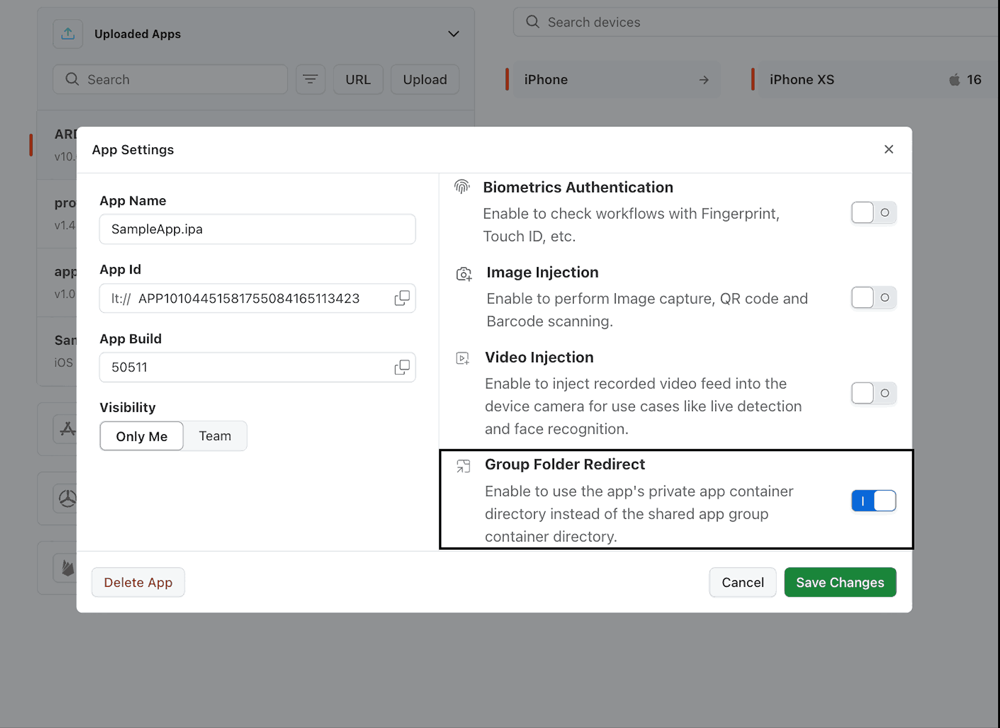

import BrandName, { BRAND_URL } from '@site/src/component/BrandName';

<script type="application/ld+json"
  dangerouslySetInnerHTML={{ __html: JSON.stringify({
    "@context": "https://schema.org",
    "@type": [
      "Article",
      "TechArticle"
    ],
    "mainEntityOfPage": {
      "@type": "WebPage",
      "@id": "https://www.testmuai.com/support/docs/group-folder-redirect-on-real-device/"
    },
    "headline": "Group Folder Redirect for iOS Apps in App Live",
    "description": "Enable Group Folder Redirect support for iOS apps on TestMu AI Real Devices.",
    "url": "https://www.testmuai.com/support/docs/group-folder-redirect-on-real-device/",
    "image": {
      "@type": "ImageObject",
      "url": "https://www.testmuai.com/support/assets/images/og-images/testmuai-documentation-og.webp",
      "width": 1200,
      "height": 630
    },
    "inLanguage": "en",
    "articleSection": "Real Device",
    "keywords": [
      "testmu ai real devices",
      "ios app live",
      "group folder redirect"
    ],
    "author": {
      "@type": "Organization",
      "@id": "https://www.testmuai.com/#organization",
      "name": "TestMu AI",
      "url": "https://www.testmuai.com/"
    },
    "publisher": {
      "@type": "Organization",
      "@id": "https://www.testmuai.com/#organization",
      "name": "TestMu AI",
      "alternateName": [
        "TestMuAI",
        "TestMu",
        "LambdaTest"
      ],
      "url": "https://www.testmuai.com/",
      "logo": {
        "@type": "ImageObject",
        "url": "https://www.testmuai.com/logo.png"
      },
      "sameAs": [
        "https://www.linkedin.com/company/testmu-ai/",
        "https://x.com/testmuai",
        "https://www.youtube.com/@TestMuAI"
      ]
    },
    "dateModified": "2026-02-12T19:51:34+05:30"
  }) }}
/>

# Group Folder Redirect On Real Devices  

<BrandName /> supports **Group Folder Redirect** for iOS apps on Real Devices.  
This feature ensures your app uses its **private container directory** instead of the **shared app group container**, which becomes inaccessible after **app resigning** on Real Devices.

---

## Use Cases 

- Ensure your app maintains **file system access** after being re-signed on Real Devices.  
- Prevent issues when your app relies on the **shared App Group container**, which becomes inaccessible after resigning.  
- Guarantee consistent **storage and retrieval of files** by using the app’s private container.  

---

## Using Group Folder Redirect in Manual Testing

**Step 1**: Click on the Real Devices > App Testing

**Step 2**: Upload your application. Open the **App Settings** to enable the **Group Folder Redirect** toggle.

**Step 4**: Select your device and start your Real Device testing session.  

---
:::info
- An **instrumented version** of your app with Group Folder Redirect support will launch.  
- The app will store and retrieve files from its **private container directory** instead of the shared App Group container.  
- File system features will function consistently even after app resigning.  
:::

