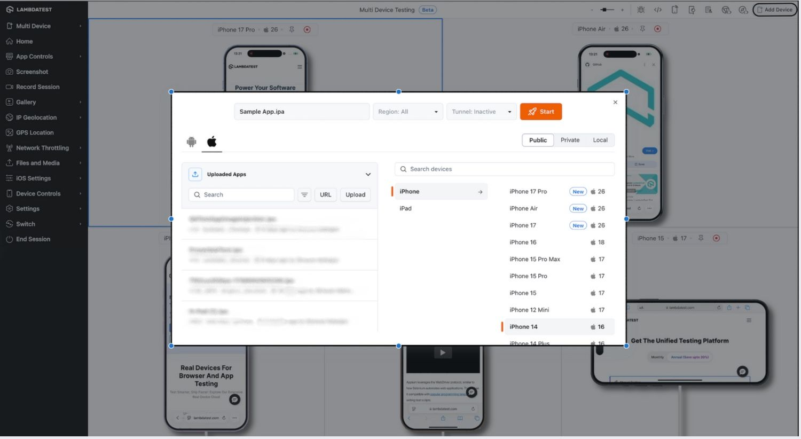
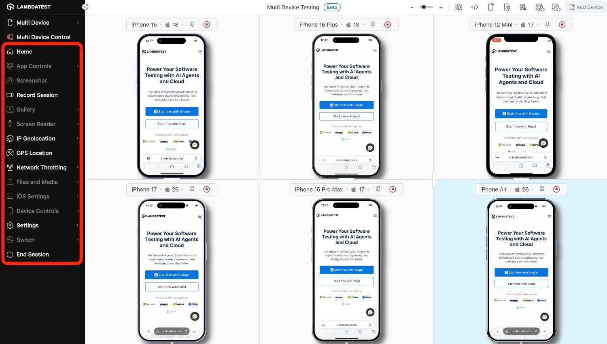

---
id: multi-device-testing
title: Multi-Device Testing on Real Devices
sidebar_label: Multi-Device Testing
description: Learn how to test multiple devices simultaneously in a single session on TestMu AI App Live, including setup, workflow, and best practices.
keywords:
  - Multi-Device Testing
  - App Live
  - Real Devices
  - Parallel Testing
slug: multi-device-testing
site_name: LambdaTest
url: https://www.testmu.ai/support/docs/multi-device-testing
---
import CodeBlock from '@theme/CodeBlock';
import BrandName, { BRAND_URL } from '@site/src/component/BrandName';

# Multi-Device Testing on Real Devices

**Multi-Device Testing** enables you to run multiple devices simultaneously in a single App Live session, allowing you to validate your application across different devices and OS versions faster and more efficiently. This approach simplifies **cross-device testing** by bringing multiple devices into a single session.

<BrandName /> allows you to run **up to 6 devices at a time** within a single session, depending on your plan’s parallel limit. You can choose different applications for each device or test multiple versions of the same app concurrently, all from a single interface, without the need to start separate sessions.

---

## Use Cases

- **Cross-Device Functional Testing**: Validate app functionality across multiple devices simultaneously.  
- **UI Consistency Check**: Ensure your app displays correctly on different screen sizes and resolutions.  
- **Multi-App Workflow Testing**: Test interactions between multiple apps in a single session.  
- **OS Version Verification**: Verify app behavior across different OS versions.  
- **Faster Regression Testing**: Reduce testing time by running multiple devices together.

---

## Multi-Device Testing Workflow

### Step 1: Open a Real Device Session

Log in to your [App Live Dashboard](https://accounts.lambdatest.com/dashboard), upload your app, and select a **real device** (Android or iOS).

---

### Step 2: Add Devices Using Multi-Device Option

Once the session is open, click on the **add device** option to add more devices. You can set  **up to 6 devices** per session and select the **device and application** for each.  

  

### Step 3: Apply Multi Device Control Settings

Once devices have been added to the session, you will see an option called **Multi-Device Control**. This feature allows you to apply common actions and settings across all connected devices simultaneously, reducing repetitive steps and ensuring consistent configurations.

 

**Supported Multi-Device Controls**

  |  **Feature** | **Description** |
  | -----------------------| ---------------------------|
  |Home          | Instantly navigate all devices to the Home screen with a single click |
  |Record Session| Start recording on all devices together, instead of initiating recordings individually|
  |IP Geolocation| Apply a unified IP geolocation to every device with one click|
  |GPS Location| Set a common GPS location across all devices simultaneously |
  |Network Throttling|Apply the same network throttling profile to all devices without configuring each device separately|
  |Settings|Update global settings such as idle timeout, language and timezone for all devices at once|

 
:::info 
- Currently, **Record Session** downloads are not compatible with QuickTime Player. If you are using macOS, you may need an alternative media player to view the recordings.
:::

---
