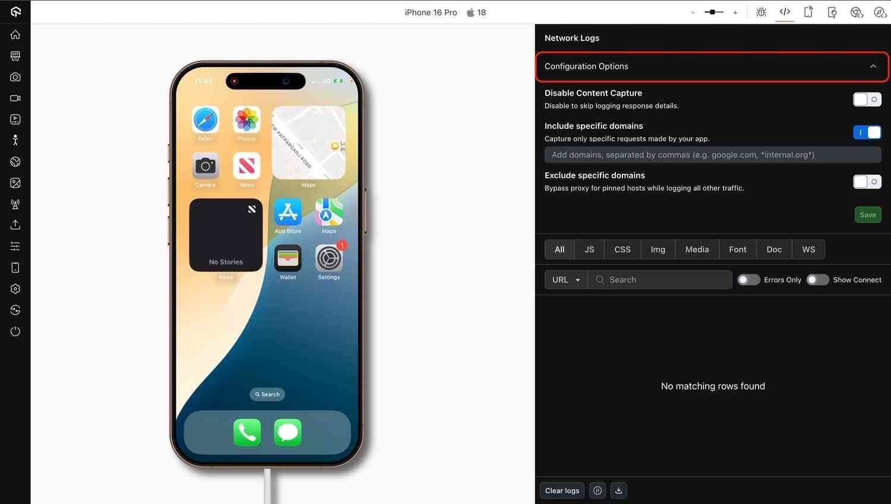
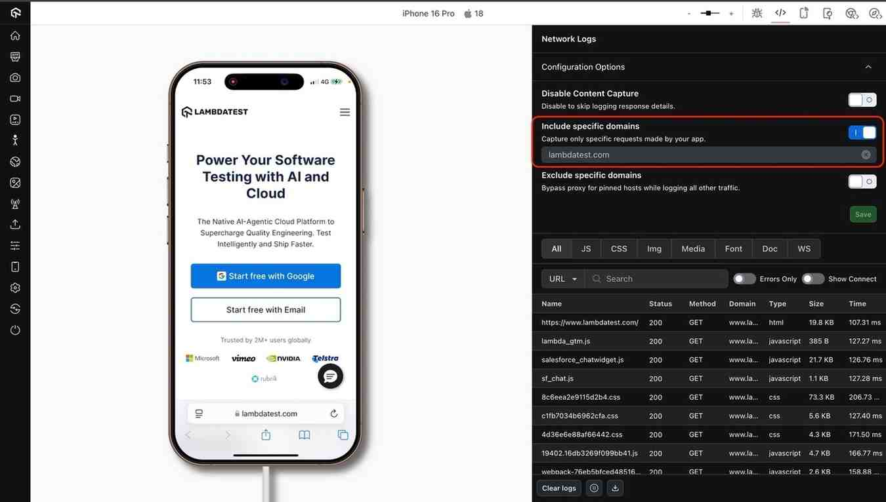
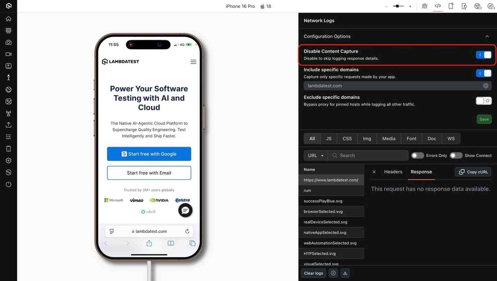
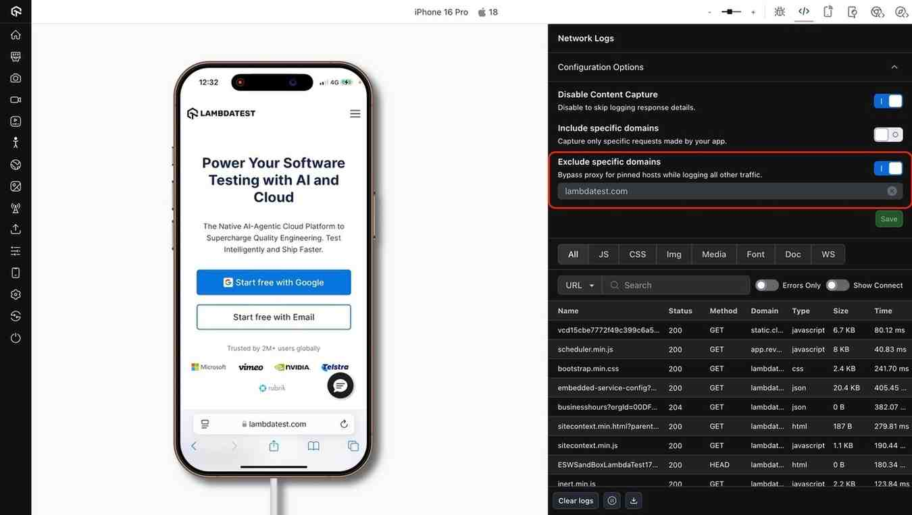

---

id: network-configurations-in-browser
title: Network Configurations in Browser Live
sidebar_label: Network Configurations 
description: Learn how to configure and capture HTTP/S traffic on real devices during manual testing in Browser Live, with options for content capture and domain filtering.
keywords:
  - testmu ai manual testing
  - network logs
  - mitm proxy 
  - http traffic capture
  - domain filtering
  - network configurations
url: https://www.testmu.ai/support/docs/network-configurations-in-browser
site_name: LambdaTest
slug: browser-network-configurations

---

import BrandName, { BRAND_URL } from '@site/src/component/BrandName';

# Network Logs and Configurations in real devices

Network logs record every network interaction during your test session, from API calls and page requests to server responses and load times. These logs are stored in HAR format, giving you a complete snapshot of **network performance** for each run. By reviewing this data, you can identify slow endpoints, troubleshoot failed requests, and validate that your app communicates with the right services—all without leaving your testing workflow.

On <BrandName />, you can enable **network configurations** to capture and analyze this traffic in real time on real devices. With flexible options such as content capture and domain-based filtering, you can focus on the most relevant network interactions while reducing noise from unrelated requests. This helps ensure faster debugging, clearer insights, and more efficient test runs.

> To enable it for your organization, please contact us via  window.openLTChatWidget()}>**24×7 chat support** or you can also drop a mail to **support@lambdatest.com**. 

--- 

### Use cases

- **Debug API calls** by viewing HTTP/S request and response data directly from real device sessions.
- **Verify backend integration** by checking if calls are made to the correct endpoints.
- **Filter noise** by including/excluding specific hosts.
- **Reproduce production issues** that depend on specific network conditions or API behaviors.

---

## Enabling Network Configuration

### Step 1: Access App Testing

Log into your <BrandName /> dashboard and navigate to Real Devices > App Testing.

### Step 2: Select your device or browser

Choose a real Android or iOS device, upload your app (APK/IPA), or open a browser URL.

### Step 3: Configure network log options

Run your app. In the network logs for your device, open the **Configuration Options** slider and select the options you want to apply for your current session.   

---

### Configuration Options

| Setting                     | Type                         | Default  | Description                                                                                                  |
|-----------------------------|------------------------------|----------|--------------------------------------------------------------------------------------------------------------|
| Capture Content              | Toggle                       | Enabled  | Captures the full response body of network requests in the DevTools Response tab. Disable if only headers or metadata are needed. |
| Include specific domains | Text input (comma-separated domains) | Empty    | Capture network requests only for the specified domains. |
| Exclude specific domains    | Text input (comma-separated domains) | Empty    | Exclude network requests to the specified domains. |

---

## Available configuration options

### **Include specific domains**:
 Use this to capture logs only for network requests to specified domains. Enable the toggle and add the domains separated by commas, as shown below.  

### **Capture content**: 
Use this option to capture or exclude response content. This is off by default but can be enabled if needed, as shown below.  

### **Exclude specific domains**: 
Use this to exclude certain domains from network logs. This works similarly to **Include specific domains**. If both options are enabled, **Exclude specific domains** takes precedence.  

---

## Best practices & tips

- Exclude noisy domains to reduce clutter in your logs.  
- Use the include list to focus on relevant domains.  
- Avoid broad patterns that may capture excessive traffic.  
- Save your settings for reuse in future sessions.

---

:::info 
- Available only on **Pro Plans** for manual testing.  
- Apps from the App Store or Play Store may not support network capture.  
- Certificate-pinned apps may fail unless pinned hosts are excluded.  
::
