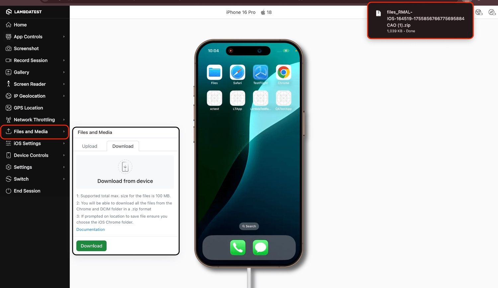

import CodeBlock from '@theme/CodeBlock';
import Tabs from '@theme/Tabs';
import TabItem from '@theme/TabItem';
import RealDeviceTag from '../src/component/realDevice';
import VirtualDeviceTag from '../src/component/virtualDevice';
import BrandName, { BRAND_URL } from '@site/src/component/BrandName';

# Upload & Download Files and Media on Real Devices

<BrandName />’s **Files & Media** feature allows you to seamlessly upload files or media from your system to real devices and download app-generated files or media back for verification. This ensures comprehensive validation of workflows such as document generation, media export, and file handling across Android and iOS devices.

---

## Supported Devices

| Platform | OS Version |
|----------|------------|
| Android  | 9 and above |
| iOS      | 13 and above |  

---

## Steps for Uploading & Downloading Files

1. **Open a Real Device Session**  
   Log in to your [App Live Dashboard](https://accounts.lambdatest.com/dashboard), upload your app, and select a real device (Android or iOS).  

2. **Use the Files & Media Panel**  
   From the **right-hand session toolbar**, click the **Files & Media** icon.  
   

  ### Upload 

   Click **Upload** to select files or media from your local system. Once uploaded, they are stored in the device’s default locations:  

   | Category        | Platform | Location                                             | File Type      |
   |-----------------|----------|------------------------------------------------------|----------------|
   | Media Files     | Android  | Gallery → `/sdcard/Pictures` or `/sdcard/Movies`    | Images, Videos |
   |                 | iOS      | Camera Roll → `/private/var/mobile/Media/DCIM/`     | Images, Videos |
   | Non-Media Files | Android  | Downloads folder                                     | Documents      |
   |                 | iOS      | Files app → On My iPhone → Your app's directory     | Documents      |

### Download
Switch to the **Download** tab in the Files & Media panel and select the files you want to export. Click the **Download** button to save them to your system. The selected files will be downloaded as a `.zip`, which you can then extract and verify.

   :::info 
    The maximum combined download size per session is 100 MB.
   :::

---

## Supported File Types

- **Images**: JPG, JPEG, PNG, GIF (Max: 10 MB)  
- **Videos**: MP4 (Max: 50 MB)  
- **Documents**: XLS, XLSX, DOC, DOCX, PDF, CSV, TXT (Max: 15 MB)  

---  
