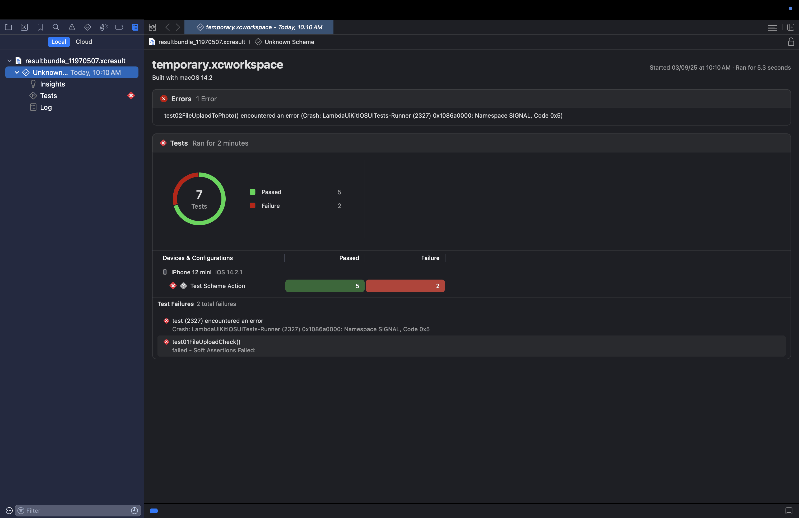

import CodeBlock from '@theme/CodeBlock';
import Tabs from '@theme/Tabs';
import TabItem from '@theme/TabItem';
import {YOUR_LAMBDATEST_USERNAME, YOUR_LAMBDATEST_ACCESS_KEY} from "@site/src/component/keys";
import BrandName, { BRAND_URL } from '@site/src/component/BrandName';

<script type="application/ld+json"
      dangerouslySetInnerHTML={{ __html: JSON.stringify({
       "@context": "https://schema.org",
        "@type": "BreadcrumbList",
        "itemListElement": [{
          "@type": "ListItem",
          "position": 1,
          "name": "Home",
          "item": BRAND_URL
        },{
          "@type": "ListItem",
          "position": 2,
          "name": "Support",
          "item": `${BRAND_URL}/support/docs/`
        },{
          "@type": "ListItem",
          "position": 3,
          "name": "How to Get XCUI XML Reports on TestMu AI",
          "item": `${BRAND_URL}/support/docs/xcui-report/`
        }]
      })
    }}
></script>

XML reports on TestMu AI give a summary of XCUI test execution so you can understand your outcomes. Use the REST APIs below to retrieve reports for non-shard builds and shard builds, either as individual shards or all shards collectively.

**Supported on:** Real &amp; Virtual devices

## Objective
---
### By the end of this document, you should be able to:

1. Fetch XML reports for non-shard XCUI builds.

2. Fetch XML reports for shard builds, both for individual shards and all shards collectively.


## XML report APIs
----

**Non-shard build :** 
To fetch the XML report for a `non-shard` build, you can use the following cURL command:


<div className="lambdatest__codeblock">
<CodeBlock className="language-bash">
{`curl --location "https://mobile-api.lambdatest.com/mobile-automation/api/v1/framework/builds/<build_id>/report/?encoder=false" \
--header 'Authorization: Basic <Base64 Authentication>'`}
</CodeBlock>
</div>


**Shard build (For single shard):**
To fetch the XML report for a `single shard` in a shard build,use:

<div className="lambdatest__codeblock">
<CodeBlock className="language-bash">
{`curl --location 'https://mobile-api.lambdatest.com/mobile-automation/api/v1/framework/jobs/<job_id>/report/?shard=<shard_id>&encoder=false' \
--header 'Authorization: Basic <Base64 Authentication>'`}
</CodeBlock>
</div>


**Shard build (For all the shards):**
To fetch the XML reports for `all shards` in a shard build, use:

<div className="lambdatest__codeblock">
<CodeBlock className="language-bash">
{`curl --location 'https://mobile-api.lambdatest.com/mobile-automation/api/v1/framework/jobs/<job_id>/report/?encoder=false' \
--header 'Authorization: Basic <Base64 Authentication>'`}
</CodeBlock>
</div>


:::note
- Authenticate the API using your <BrandName /> username and access key, and replace `build_id`, `job_id` and `shard_id` for which you want to fetch report.
- It is recommended to run the sharding test(via HyperExecute CLI) in the verbose mode i.e. with the **--verbose** flag. This allows the shard ID(task ID) and build ID(Job ID) to be displayed in the logs and then they can be used to fetch the above reports.
- In case the report is not a valid XML format, the `encoder=true` parameter can be utilized to prevent the decoding of certain characters. Decoding is usually performed at the server's end to enhance the readability of the report. 
:::

## XCResult Report

### XCResult on <BrandName />
Apple’s **Native XCResult Bundles (`.xcresult`)** are comprehensive test reports generated when you run XCUITest cases. These bundles include **test hierarchy, logs, stack traces, screenshots, and performance data**, which can be directly viewed in Xcode. They provide developers with rich debugging information, making it easier to analyze why a test passed or failed.  

On <BrandName />, you can now **generate and download `.xcresult` bundles** for your XCUI test sessions. You can access them via the **REST API**.

---
### Prerequisites

- Your <BrandName /> [Username and Access Key](https://www.testmuai.com/login/?redirectTo=https://accounts.lambdatest.com/security).  
- Access to an **iOS app (.ipa)** and an **XCUI Test app (.ipa)**.  
- Xcode installed locally to view `.xcresult` bundles.  

---

### Flow for Adding XCUI Result Bundles

#### Step 1: Upload Your Application and Test Suite

To begin testing, you need to upload both your iOS application (.ipa) file and your XCUI test suite (.ipa) file to <BrandName />. These files are required before executing tests.

Detailed upload steps are available here: [Getting Started with XCUI Testing - Running Your First Test](/support/docs/getting-started-with-xcuitest/#running-your-first-test-a-step-by-step-guide)

#### Step 2: Execute Your Tests with Result Bundles

To generate `.xcresult` bundles for your XCUI test executions, you must pass `"enableResultBundle": true` in your build request and use the new build endpoint:

```
POST https://mobile-api.lambdatest.com/mobile-automation/api/v1/xcuitest/builds
```

This endpoint initiates your test run and enables generation of the result bundle.

| Parameter          | Description                                           | Values                          |
|--------------------|-------------------------------------------------------|--------------------------------|
| enableResultBundle  | Enable generating result bundles for your XCUI build. | true/false (default: false)    |

Below is an example cURL command to execute your test with result bundles enabled:

<Tabs className="docs__val">

<TabItem value="bash" label="Linux / MacOS" default>

  <div className="lambdatest__codeblock">
    <CodeBlock className="language-bash">

```bash
curl --location --request POST 'https://mobile-api.lambdatest.com/framework/v1/xcui/build' \
--header 'Authorization: Basic BASIC_AUTH_TOKEN' \
--header 'Content-Type: application/json' \
--data-raw '{
  "app" : "APP_ID",
  "testSuite": "TEST_SUITE_ID",
  "device" :  ["iPhone 11-14"],
  "video" : true,
  "queueTimeout": 10800,
  "idleTimeout": 150,
  "devicelog": true,
  "network": false,
  "build" : "Proverbial-XCUITest",
  "enableResultBundle": true
}'
```

</CodeBlock>
</div>

</TabItem>

<TabItem value="powershell" label="Windows" default>

  <div className="lambdatest__codeblock">
    <CodeBlock className="language-powershell">

```bash
curl --location --request POST "https://mobile-api.lambdatest.com/framework/v1/xcui/build" \
--header "Authorization: Basic BASIC_AUTH_TOKEN" \
--header "Content-Type: application/json" \
--data-raw "{
  "app" : "APP_ID",
  "testSuite": "TEST_SUITE_ID",
  "device" :  ["iPhone 11-14"],
  "video" : true,
  "queueTimeout": 10800,
  "idleTimeout": 150,
  "devicelog": true,
  "network": false,
  "build" : "Proverbial-XCUITest",
  "enableResultBundle": true
}"
```
  </CodeBlock>
</div>

</TabItem>
</Tabs>

#### Step 3: Retrieve the Result Bundle

Result bundles are generated at the Build level. To download the `.xcresult` bundle for a specific session, use the following GET endpoint:

:::note
- In case of sharding, each shard execution is treated as a separate shards and generates its own `.xcresult` bundle. You will need to retrieve each shard's bundle individually. For more information, see [Sharding in HyperExecute](/support/docs/sharding-rd-hyperexec/).
- To view the `.xcresult` for a specific shard, you must pass the `shard:shardId` as a query parameter in your request.
:::

```
GET https://mobile-api.lambdatest.com/mobile-automation/api/v1/framework/builds/{build-id}/xcresult
```

Replace `{build-id}` with the actual build ID.

Example cURL command to download the result bundle:

<div className="lambdatest__codeblock">
  <CodeBlock className="language-bash">
{`curl --location --request GET \\
'https://mobile-api.lambdatest.com/mobile-automation/api/v1/framework/builds/{build-id}/xcresult' \\
--header 'Authorization: Basic BASIC_AUTH_TOKEN' \\
--output xcui-result-bundle.zip`}
  </CodeBlock>
</div>

:::tip
You will need your **BASIC_AUTH_TOKEN** (Base64 encoded `username:accesskey`) in the request header.  
If you’re unsure how to generate it, follow the instructions here: [Executing the Test](/support/docs/getting-started-with-xcuitest/#step-3-executing-the-test).
:::

The response is a binary ZIP file containing the `.xcresult` bundle, which you can unzip and open directly in Xcode for detailed analysis.

#### Step 4: Report Structure

The `.xcresult` bundle contains a comprehensive report of your XCUI test execution, including:

- **Summary View**: Shows total tests executed, number passed, and number failed with a visual chart.
- **Errors Section**: Lists any critical errors or crashes encountered (e.g., test runner crashes with signal codes).
- **Tests Section**: Provides execution duration, device and OS version details, and per-device results.
- **Device & Configuration Matrix**: Displays which tests passed/failed on specific device configurations.
- **Individual Test Details**: Each test case shows its status (pass/fail), failure reason, logs, and any assertion errors.


You can open the `.xcresult` bundle directly in Xcode to explore these details visually, enabling efficient debugging and analysis of your test runs.



<nav aria-label="breadcrumbs">
  <ul className="breadcrumbs">
    <li className="breadcrumbs__item">
      <a className="breadcrumbs__link" target="_self" href={BRAND_URL}>
        Home
      </a>
    </li>
    <li className="breadcrumbs__item">
      <a className="breadcrumbs__link" target="_self" href={`${BRAND_URL}/support/docs/`}>
        Support
      </a>
    </li>
    <li className="breadcrumbs__item breadcrumbs__item--active">
      <span className="breadcrumbs__link">
        How to Get XCUI XML Reports on TestMu AI
      </span>
    </li>
  </ul>
</nav>
