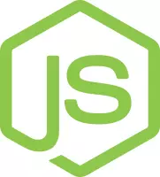
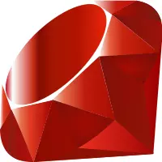
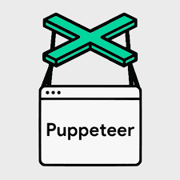
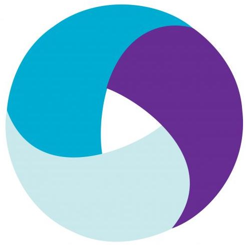
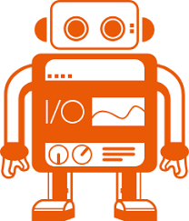
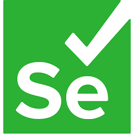
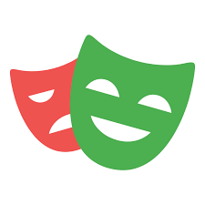
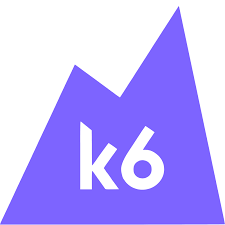

SmartUI is a visual testing tool that helps in identifying visual regressions in web applications. It uses advanced image comparison techniques to detect differences between baseline images and those captured during subsequent test runs.

### Test with SmartUI

<CardGroup cols={2}>
  <Card title="SDK" href="/support/docs/smartui-selenium-java-sdk/">
    Perform Visual UI Testing using CLI.
  </Card>
  <Card title="Lambda Hooks" href="/support/docs/selenium-visual-regression/">
    Perform Visual UI Testing using Hooks.
  </Card>
  <Card title="Figma Designs" href="/support/docs/smartui-cli-figma/">
    Perform Visual UI testing of Figma Designs using SmartUI.
  </Card>
  <Card title="PDFs" href="/support/docs/smartui-pdf-comparison/">
    Perform Visual UI testing of PDFs using SmartUI.
  </Card>
  <Card title="Upload through API" href="/support/docs/smartui-upload-api-v2/">
    Upload Screenshots through API for Visual UI Testing.
  </Card>
  <Card title="Upload through CLI" href="/support/docs/smartui-cli-upload/">
    Upload Screenshots through CLI for Visual UI Testing.
  </Card>
  <Card title="Storybook" href="/support/docs/smart-ui-storybook/">
    Perform Visual UI Testing using Storybook on SmartUI.
  </Card>
  <Card title="Git Baseline Branching" href="/support/docs/smartui-git-branching-strategy/">
    Learn how to execute SmartUI CLI with Git Commits.
  </Card>
</CardGroup>

<Tabs>
  <Tab title="SDK">
    <Tabs>
    <Tab title="Selenium">
    

      

        
        <a>Java</a> 
      

      

        
        <a>JavaScript</a> 
      

      

        
        <a>C#</a> 
      

      

        
        <a>Python</a> 
      

      

        
        <a>Ruby</a> 
      

    

    </Tab>
    <Tab title="Playwright">
      

        

        
        <a>JavaScript</a> 
      

      

        
        <a>Python</a> 
      

      

    </Tab>
    <Tab title="Puppeteer">
    

        
        <a>Puppeteer</a> 
      

    </Tab>
    <Tab title="TestCafe">
    

        
        <a>TestCafe</a> 
      

    </Tab>
    <Tab title="Cypress">
    

        
        <a>Cypress</a> 
      

    </Tab>
    <Tab title="Appium">
   

        
        <a>Appium</a> 
      

    </Tab>
    <Tab title="WebdriverIO">
    

        
        <a>WebdriverIO</a> 
      

    </Tab>
    </Tabs>
  </Tab>

  <Tab title="Hooks">
    

    

        
        <a>Selenium</a> 
      

      

        
        <a>Playwright</a> 
      

      

        
        <a>Pupeteer</a> 
      

      

        
        <a>K6</a> 
      

      

        
        <a>Cypress</a> 
      

      

        
        <a>Appium</a> 
      

      

        
        <a>Espresso</a> 
      

      

        
        <a>XCUI</a> 
      

    

  </Tab>
</Tabs>

<Note>
  In case your favorite framework or tool isn't listed here, just [give us a shout out](https://www.lambdatest.com/contact-us).  
  In case of any other problems, feel free to [contact us](https://www.lambdatest.com/contact-us).
</Note>
