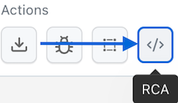

BETA

Smart Root Cause Analysis (RCA) in SmartUI helps you instantly identify the underlying reasons for visual mismatches. By analyzing the DOM differences between the baseline and the comparison screenshot, RCA pinpoints exactly what changed—whether it's a style update, content change, or layout shift.

## Why use Smart RCA?
- **Speed**: Instantly find why a pixel-level mismatch occurred.
- **Precision**: Distinguish between actual bugs and intended changes.
- **Actionable Insights**: Get direct info on CSS property changes or DOM structure modifications. visually failing tests with speed and confidence.

## What Problems Does Smart RCA Solve?

Visual testing often tells you that something is wrong but not what caused it. Smart RCA eliminates the guesswork and manual debugging by providing immediate, actionable insights.

| Problem | Smart RCA Solution |
|---|---|
| The UI looks broken, but you don’t know why. | Click to inspect the exact HTML, CSS, and Text changes. |
| The visual diff isn't providing enough detail. | RCA shows an in-depth DOM comparison. |
| The team wastes time on manual debugging. | RCA provides an instant root cause, saving time. |
| The layout shifted because of a small style change. | RCA pinpoints the exact CSS properties that changed. |
| Invisible elements are affecting the layout. | RCA highlights changes to all elements, even invisible ones. |

---

## How to Use Root Cause Analysis

### Prerequisites

<Info>
INFO

Before you begin, please ensure the build was generated using a **LambdaTest CLI (exec)** command.
</Info>

### Step 1: Activate RCA Mode

1.  Open a visual build from your [SmartUI dashboard](https://smartui.lambdatest.com/).
2.  In the comparison toolbar, click the **RCA** icon.

  

When RCA is activated, DOM diff boxes are automatically enabled. There's nothing manual to configure—you're ready to investigate immediately.

### Step 2: Investigate DOM Differences Visually

As soon as RCA mode is on, you can interact with the highlighted differences to see the underlying code changes. The selection is visually precise, with overlays that follow the true element boundaries, not just approximate pixel areas.

| User Interaction | Visual Feedback & Result |
|---|---|
| **Default View**    | A dark blue highlight box appears by default, pinpointing the exact DOM element where the primary issue is detected. |
| **Hover** on a diff region   | A yellow bounding box appears, indicating the element is ready for selection. |
| **Click** a diff region    | A red box locks onto the selected DOM region, and the RCA panel opens on the right. |
| **Hover** while selected    | A blue highlight box appears over the element, helping to transition focus between the screenshot and the RCA panel. |

### Step 3: Understand Detailed Changes in the RCA Panel

Once an element is selected, the RCA panel opens on the right sidebar. It displays structured diff breakdowns across several categories:

| Category | What You'll See |
|---|---|
| **DOM Path** | The full XPath for the element in both the baseline and captured screenshot. |
| **Computed Styles** | A list of all style changes. *Removed properties are highlighted in red*, and *added properties are highlighted in green*. |
| **Bounding Box** | The exact `left`/`top` position and `width`/`height` of the element, before and after the change. |
| **Attribute Changes** | A clear view of any added, removed, or modified HTML attributes. |
| **Tag Transforms** | Structural changes, such as a `
` becoming an `<article>`. |
| **Text Modifications** | A word-by-word diff of any edited content. |
| **Layout Shifts** | Details on how the layout was affected, using CSS diffs for properties like `display`, `transform`, `margin`, etc. |

## Key Advantages of Smart RCA

* **Accelerated Debugging**: By pinpointing the exact line of code or style property that caused a failure, RCA drastically cuts down the time from bug detection to resolution.
* **Reduced Friction**: Eliminate the need to constantly switch between your testing tool, browser dev tools, and application code. All the information you need is in one unified view.
* **Improved Collaboration**: Share precise, actionable bug reports. Instead of describing a visual bug, you can link your team directly to the RCA view, showing them the exact DOM and CSS changes responsible.
* **Focus on Meaningful Changes**: The system intelligently filters out noise, ensuring you and your team are alerted only to significant changes that impact user experience.
* **No False Triggers**: RCA works only where DOM diff data is available, ensuring a smooth and guided experience without misleading information.
